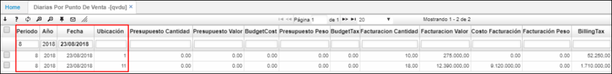

# QVDU - Diarias por punto de venta

La aplicación **QVDU** permite consultar la relación de ventas diarias por punto de venta.  

Podemos filtrar por mes, año, fecha y punto de venta para una consulta más exacta.  

Podremos ver la cantidad de facturación realizada en el día de consulta, el valor de dicha facturación y el costo, entre otra información.  

