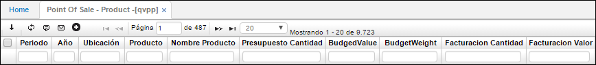

# Point of Sale - Product - QVPP

La aplicación **QVPP** – Punto de venta – Producto, permite ver la información relacionada entre la ubicación, que es el punto de venta, y el producto facturado. Arroja la cantidad de productos facturados a cada ubicación y el valor total de facturación. Igualmente, en caso de devolución muestra las cantidades devueltas y el valor total de dicha devolución.

**Periodo:** Mes de consulta.  
**Año:** Año de consulta.  
**Ubicación:** Número de ubicación asignado al punto de venta.  
**Producto:** Identificación del producto facturado.  
**Nombre producto:** Nombre del producto facturado.  

