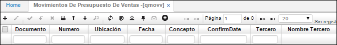
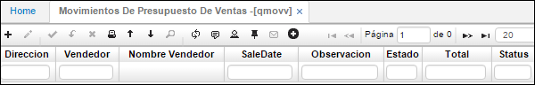
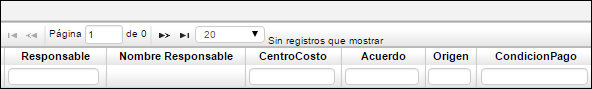
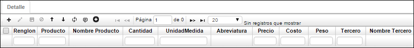

# Movimientos de Presupuestos de Ventas - QMOVV

Esta aplicación permite relacionar los ingresos provenientes de las actividades básicas de la empresa durante un periodo determinado. Acorde a la actividad de la empresa se puede dar el caso de que en una empresa manufacturera y comercial el presupuesto de ventas este determinado por el volumen de unidades que esperan vender, mientras que en una empresa de servicios, los ingresos estén determinados por la cantidad de servicios que la compañía espera prestar en un periodo determinado.

La función de principal de esta aplicación es la carga de presupuesto de ventas de compañía ya sea por producto o vendedor.

**Documento:** Tipo de documento.  
**Número:** Dato con el cual se conoce la factura en todo el sistema. La numeración puede ser asignada automática o manualmente.  
**Ubicación:** Lugar desde donde se efectúa la venta.  
**Fecha:** Fecha en la que se realizó la venta.  
**Concepto:** Campo indicador del tipo de movimiento efectuado.  
**ConfirmDate:** Fecha de confirmación de venta.  
**Tercero:** Proveedor evaluado.  

**Dirección:** Código de la sucursal o agencia del cliente.  
**Vendedor:** Número de identificación del vendedor.  
**Nombre Vendedor:** Nombre de la persona que realizó la venta, se utiliza este campo para la generación de las comisiones por ventas correspondientes.  
**SaleFecha:** Fecha en la que se realizó la venta.  
**Observación:** Campo que registra la descripción de registro.  
**Estado:** Estado del movimiento.  

**Centro de Costo:** Este campo permite el ingreso del número identificador de los centros de costos parametrizados en el sistema.
**Condición de Pago:** Condición de pago definida para esta factura, la toma por defecto de las condiciones definidas para el cliente o de las condiciones definidas para el pedido en caso de corresponder a un pedido. Es muy importante este campo para la generación de la CARTERA puesto que con base a esto va a generar las cuotas o vencimientos de cartera correspondientes a las ventas a crédito.

Detalle de la aplicación **QMOVV** – Movimiento de presupuestos de ventas.

Listado de productos facturados con sus cantidades y precios. Totales en cantidades y costo total de la mercancía.

**Renglón:** Número que identifica cada fila o registro del detalle. No pueden existir dos números de renglón repetidos.  
**Producto:** Código y nombre del producto.  
**Cantidad:** Cantidad del producto que se factura.  
**Und:** Unidad de Medida del producto.  
**Precio:** Precio correspondiente a la lista de precios definida para el cliente.
**Peso:** Peso que tiene la mercancía facturada.  

