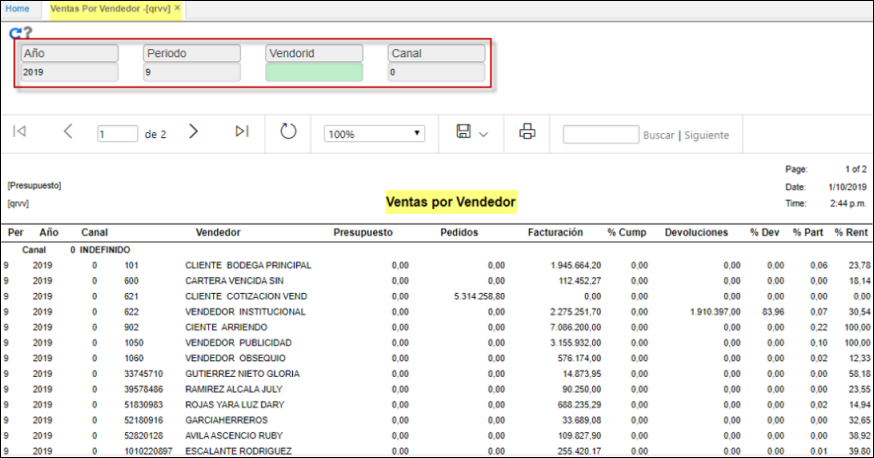

---
layout: default  
title: Ventas por Vendedor  
permalink: /Operacion/scm/facturacion/qvreporte/qrvv  
editable: si  
---  

# Ventas por Vendedor - QRVV  

Nuevo reporte de presupuesto de ventas QRVV denominado, ventas por vendedor. Realiza agrupamiento por canal.  
Filtros a establecer:  
**Año: periodo fiscal.  
Periodo: parametrizacion del BPER, basico de periodos.  
Vendedor: se establece desde el BTER.  
Canal: parametrizacion que se realiza desde el BUBI, basico de ubicaciones.**  

  
