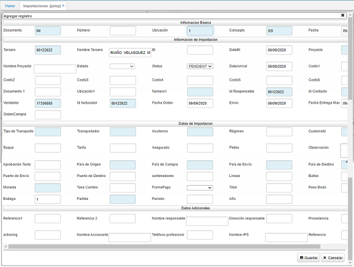
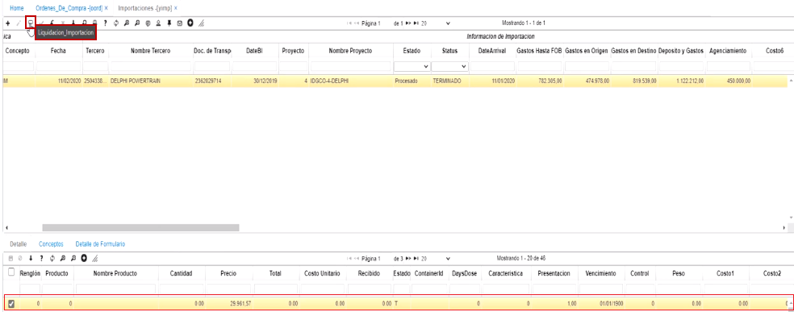

# YIMP - Importaciones

## [Proceso de importaciones](http://docs.oasiscom.com/Operacion/scm/importacion/yimportaci/yimp#proceso-de-importaciones)

A continuación, se dará a conocer el proceso de importaciones y la parametrización requerida para ejecutarlo.  

### Parametrización

Para realizar el proceso de importaciones es necesario realizar previamente la parametrización de las siguientes aplicaciones. (_Ver cada aplicación_).  

 * [**BDOC - Documentos**](http://docs.oasiscom.com/Operacion/common/bsistema/bdoc)  

En la aplicación BDOC - Documentos es necesario parametrizar el documento _IM - Importación_ y asociar en el detalle los conceptos por los cuales se podrá realizar un documento IM.  

**_Nota:_** El campo _ORDEN_ es de gran importancia asignarlo, dado que es el que define el orden de ejecución de los conceptos.  

 * [**BCON - Conceptos**](http://docs.oasiscom.com/Operacion/common/bsistema/bcon)  

En la aplicación BCON se reflejan los conceptos asociados en la aplicación BDOC al documento _IM - Impotaciones_, aquí se deberán asignar las fórmulas a cada concepto.  

 * [**BINC - Incoterms**](http://docs.oasiscom.com/Operacion/common/bcomer/binc#importaci%C3%B3n)  

De acuerdo con el modelo de importación y de incoterms que maneje la empresa, se crean los conjuntos de conceptos en la aplicación _BINC - Incoterms_.  

Por cada registro que se cree en el maestro se deberá asociar el conjunto de conceptos en el detalle.  

 *  [**YBMO - Modos de transporte**](http://docs.oasiscom.com/Operacion/scm/importacion/ybasica/ybmo)  

En la aplicación YBMO se parametrizan los modos de transporte para la importación o exportación de mercancía.  

 * [**BADU - Aduanas**](http://docs.oasiscom.com/Operacion/common/bcomer/badu)  

En la aplicación BADU se parametrizan los puertos a los que llega la mercancía.  

 * [**BCUE - Cuentas**](http://docs.oasiscom.com/Operacion/common/bcuenta/bcue#parametrizaci%C3%B3n-cuenta-importaciones)  

En la aplicación BCUE se debe crear la cuenta contable de importaciones.  

Es necesario que a la cuenta creada de importaciones se parametrice el módulo _Y_, se marque el flag como _Imputable_ y el flag _Project_ para que siempre se deba asociar un proyecto en cada importación.  

### Proceso de importaciones

_**Orden de Compra**_  

Para iniciar con el proceso de importaciones debemos crear una órden de compra en la aplicación [**OORD - Ordenes de compra**](http://docs.oasiscom.com/Operacion/scm/compras/oorden/oord).  

La orden de compra se hace al proveedor en la moneda de negociación utilizando una tasa de cambio de referencia. Recordemos que las monedas se parametrizan en la aplicación [**BMON - Monedas**](http://docs.oasiscom.com/Operacion/common/bfinan/bmon).  

En el detalle de la aplicación OORD asociaremos los productos de importación, las cantidades y los precios. Los precios se reflejarán en la moneda definida en el maestro.  

Vista previa de la orden de compra. Puede ser exportada en formato de Word, PFD o Excel.  

_**Preliquidación de la importación**_  

Seguidamente, se deberá realizar la preliquidación de la importación en la aplicación [**YIMP - Importaciones**](http://docs.oasiscom.com/Operacion/scm/importacion/yimportaci/yimp#proceso-de-importaciones).  

Se creará un documento _IM_ por concepto IM y se completará el formulario con la información de la importación.  

**Documento:** seleccionar el documento _IM - Importación_.  
**Concepto:** seleccionar el concepto _IM - Importación_.  
**Fecha:** fecha en la cual se realiza la preliquidación.  
**Tercero:** ingresar o seleccionar del zoom el número de identificación del proveedor.  
**BI:** ingresar el número del documento BI.  
**DateBI:** ingresar la fecha del documento BI.  
**Proyecto:** seleccionar del zoom el proyecto al cual se asocia la importación.  
**DateArrival:** fecha en la cual llegará la mercancía.  
**Costo1, Costo2, Costo3, Costo4:** estos campos no se encuentran dentro de los conceptos parametrizados pero se suman a la liquidación. Están habilitados para que se ingresen costos que no estaban previstos.  
**Documento1:** para asociar la orden de compra debemos primero indicar en este campo las siglas de la orden _OC_.  
**Ubicación1:** indicamos la ubicación en la cual se realizó la orden de compra.  
**Número1:** al dar doble click en este zoom, se habilitán todas las ordenes de compra, se debe seleccionar la relacionada con la importación a la cual se le realiza preliquidación.  
**Tipo de Transporte:** seleccionamos del zoom el tipo de transporte en que se importa la mercancía.  
**Transportador:** ingresar el número de identificación del proveedor que transporta la mercancía.  
**Incoterms:** seleccionar el incoterm que aplica.  
**Buque:** ingresar el nombre del buque que transporta la mercancía.  
**País de origen, de compra, de envío, de destino:** ingresar el país de donde proviene la mercancía, el país que importa la mercancía, el país que se encarga de enviar la mercancía y el país destino a donde llegará la mercancía.  
**Puerto de envío:** nombre del puerto o aeropuerto desde donde se envía la mercancía.  
**Puerto de destino:** nombre del puerto o aeropuerto a donde llegará la mercancía.  
**Containers:** cantidad de containers en los que viene la mercancía.  

Diligenciado el formulario damos click en _Guardar_.  

Al dar click en _Guardar_, el sistema trae el detalle con los productos de la orden de compra, cantidades y precios.  

Verificada la información traída de la orden de compra, damos click en el botón del maestro llamado _**Liquidación Importación**_ con el cual se calcularán los conceptos que serán parte del costo de la importación.  

El sistema arrojará un mensaje de confirmación y creará el renglón 0 en el detalle, este no se deberá eliminar.  

En la siguiente pestaña del detalle podremos ver el cálculo de los conceptos por producto.  

**_Nota:_** Si se requiere modificar algún dato del maestro, es necesario volver a dar click en el botón _**Liquidación Importación**_.  

Verificada la información tanto del maestro como del detalle se puede imprimir o proceder a procesar el documento IM.  

_**Entrada a inventarios**_  

Realizada la preliquidación se requiere ingresar la mercancía que se está importando al inventario. _Este proceso se recomienda hacer después de nacionalizada la mercancía._  

En la aplicación [**IMOV - Movimientos de inventarios**](http://docs.oasiscom.com/Operacion/scm/inventarios/imovimient/imov#ingreso-de-mercancía-importada) creamos un nuevo registro con documento **EN - Entradas al inventario** y concepto **EI - Entrada por importación**.  

La entrada de inventarios se ingresa con moneda 0 correspondiente a pesos. Se debe asociar el documento **IM** de la importación creado previamente en la aplicación [**YIMP - Importaciones**](http://docs.oasiscom.com/Operacion/scm/importacion/yimportaci/yimp#proceso-de-importaciones).  

Diligenciado el formulario damos click en el botón _Guardar_. El sistema al guardar el maestro arrojará automáticamente el detalle de la importación con los costos por producto en pesos colombianos.  

Finalmente, procesamos el documento **EN** y verificamos la pestaña del detalle **Contabilización**.  

_**Validación de liquidaciones**_  

Una vez finalice la causación de las facturas asociadas a la importación, se debe validar la información de la liquidación total en la aplicación _YLIQ - Liquidaciones_. Consultamos por el proyecto que esté asociado a la importación.  

Aquí finaliza el proceso de importaciones en OasisCom.  