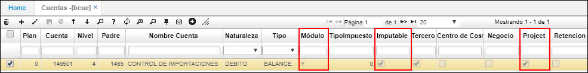
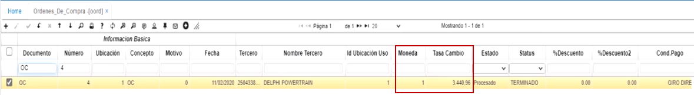
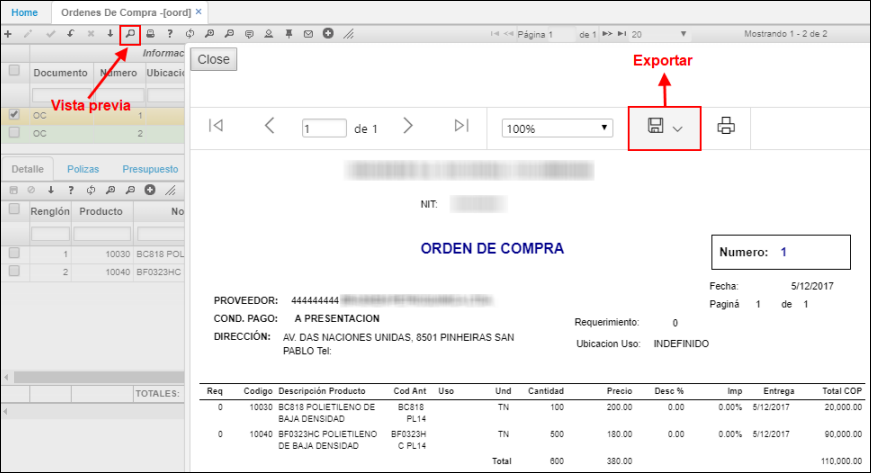

# YIMP - Importaciones

## [Proceso de importaciones](http://docs.oasiscom.com/Operacion/scm/importacion/yimportaci/yimp#proceso-de-importaciones)

A continuación, se dará a conocer el proceso de importaciones y la parametrización requerida para ejecutarlo.  

### Parametrización

Para realizar el proceso de importaciones es necesario realizar previamente la parametrización de las siguientes aplicaciones. (_Ver cada aplicación_).  

 * [**BDOC - Documentos**](http://docs.oasiscom.com/Operacion/common/bsistema/bdoc)  

En la aplicación BDOC - Documentos es necesario parametrizar el documento _IM - Importación_ y asociar en el detalle los conceptos por los cuales se podrá realizar un documento IM.  

**_Nota:_** El campo _ORDEN_ es de gran importancia asignarlo, dado que es el que define el orden de ejecución de los conceptos.  

 * [**BCON - Conceptos**](http://docs.oasiscom.com/Operacion/common/bsistema/bcon)  

En la aplicación BCON se reflejan los conceptos asociados en la aplicación BDOC al documento _IM - Impotaciones_, aquí se deberán asignar las fórmulas a cada concepto.  

 * [**BINC - Incoterms**](http://docs.oasiscom.com/Operacion/common/bcomer/binc#importaci%C3%B3n)  

De acuerdo con el modelo de importación y de incoterms que maneje la empresa, se crean los conjuntos de conceptos en la aplicación _BINC - Incoterms_.  

Por cada registro que se cree en el maestro se deberá asociar el conjunto de conceptos en el detalle.  

 *  [**YBMO - Modos de transporte**](http://docs.oasiscom.com/Operacion/scm/importacion/ybasica/ybmo)  

En la aplicación YBMO se parametrizan los modos de transporte para la importación o exportación de mercancía.  

 * [**BADU - Aduanas**](http://docs.oasiscom.com/Operacion/common/bcomer/badu)  

En la aplicación BADU se parametrizan los puertos a los que llega la mercancía.  

 * [**BCUE - Cuentas**](http://docs.oasiscom.com/Operacion/common/bcuenta/bcue#parametrizaci%C3%B3n-cuenta-importaciones)  

En la aplicación BCUE se debe crear la cuenta contable de importaciones.  

Es necesario que a la cuenta creada de importaciones se parametrice el módulo _Y_, se marque el flag como _Imputable_ y el flag _Project_ para que siempre se deba asociar un proyecto en cada importación.  

### Proceso de importaciones

Para iniciar con el proceso de importaciones debemos crear una órden de compra en la aplicación [**OORD - Ordenes de compra**](http://docs.oasiscom.com/Operacion/scm/compras/oorden/oord).  

La orden de compra se hace al proveedor en la moneda de negociación utilizando una tasa de cambio de referencia. Recordemos que las monedas se parametrizan en la aplicación [**BMON - Monedas**](http://docs.oasiscom.com/Operacion/common/bfinan/bmon).  

En el detalle de la aplicación OORD asociaremos los productos de importación, las cantidades y los precios. Los precios se reflejarán en la moneda definida en el maestro.  

Vista previa de la orden de compra. Puede ser exportada en formato de Word, PFD o Excel.  

Seguidamente, se deberá crear la preliquidación de la importación en la aplicación [**YIMP - Importaciones**]()

