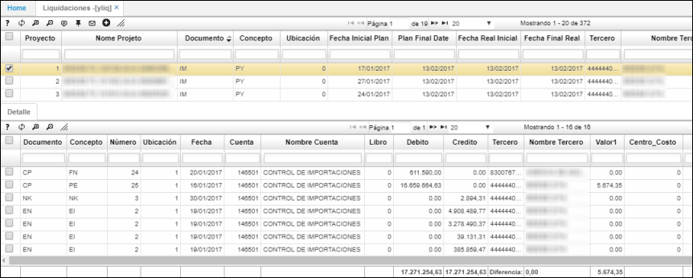
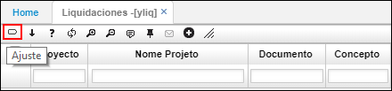

# YLIQ - Liquidaciones

En la aplicación YLIQ se visualizan las liquidaciones de importaciones por proyectos. Consultamos por el proyecto que esté asociado a la importación.  

La aplicación cuenta con un botón llamado _Ajuste_ , el cual valida la diferencia entre lo contabilizado _vs_ lo calculado en la entrada de inventario, y realiza el ajuste de acuerdo a 3 escenarios:  

**a.** Si el producto se encuentra en el inventario aún, se debe ajustar la cuenta del inventario contra la cuenta del control de importaciones (la aplicación YLIQ informa la cuenta).  

**b.** Si la mercancia ya fue vendida y no se encuentra en el inventario, se debe realizar el ajuste contra la cuenta del costo de venta de dichos productos.  

**c.** Si se ha vendido una parte del inventario se debe realizar el ajuste al saldo de la cuenta de inventario por el producto que aún no se ha vendido y el ajuste a la cuenta del costo de ventas por el porcentaje ya vendido. Siempre la contrapartida es la cuenta de control de inventarios que se crea y se administra en las empresas que tienen implementado el módulo de importaciones.  

