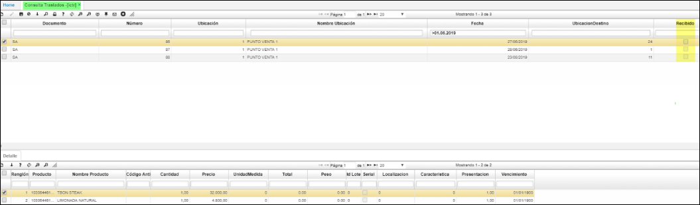

# ICTR - Consulta de Traslados 

La aplicación de consulta **ICTR** permite visualizar los traslados de inventario.  
Extrae la informacion de los movimiento de inventarios, con rango de busqueda concepto TR (traslado).  
Cuando se aplica el boton de recibido, indica que fisicamente estan los productos.  
En el detalle se relaciona cada uno de los articulos y caracteristicas de cada campo.  

  

