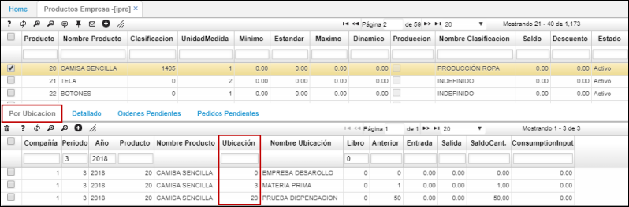
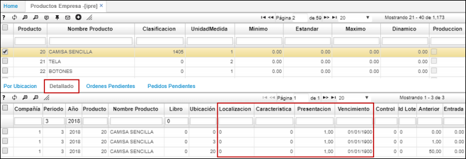
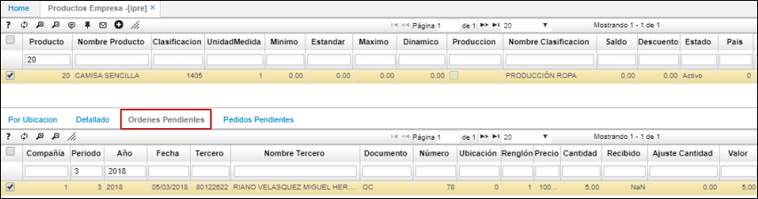
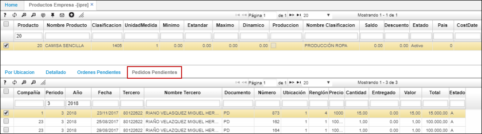

# IPRE - Productos Empresas

La aplicación **IPRE** permite consultar información a cerca del inventario, datos detallados, ordenes pendientes y pedidos pendientes del producto seleccionado en el maestro. La aplicación mostrará la información de todas las empresas a las que el usuario tenga permiso de acceso.  

En la primera pestaña veremos el inventario existente del producto por ubicaciones.  

En la segunda pestaña se verá información más al detalle del producto seleccionado, como: localización, característica, presentación, vencimiento, entre otros.  

En la tercera pestaña encontraremos la información correspondiente a las órdenes de compra pendientes que tiene el producto.  

Finalmente, en la cuarta pestaña veremos los pedidos pendientes con ese producto.  

