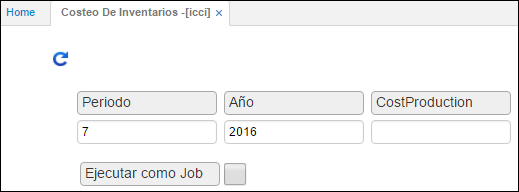

# Costeo de Inventario - ICCI

Proceso que ejecuta el costeo de inventarios de acuerdo al sistema y método definido para la empresa. Lo ejecuta para todas las bodegas y verifica que el cierre de inventarios para el periodo ya se haya efectuado. Se puede ejecutar cuantas veces se quiera, en el caso de no tener los datos de costos consistentes. Sus resultados se pueden observar en la pantalla de kardex.  

