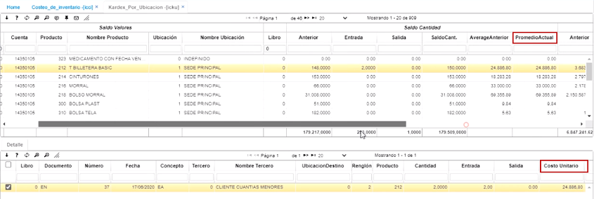

---

layout: default
title: Costos
permalink: /Operacion/scm/inventarios/icosto/icci
editable: si

---

# Costeo de Inventario - ICCI

Esta aplicación toma todos los movimientos y los productos de un periodo, reconstruye su costo; desprocesa los documentos y los vuelve a procesar asignándoles el costo, por si tenemos alguna inconsistencia en dicho costo. Actualiza el costo promedio de cada una de las transacciones. Ejecuta el costeo de inventarios de acuerdo con el sistema y método definido para la empresa. Lo ejecuta para todas las bodegas y verifica que el cierre de inventarios para el periodo ya se haya efectuado. Se puede ejecutar cuantas veces se quiera, en el caso de no tener los datos de costos consistentes. Sus resultados se pueden observar en la pantalla de Kardex.  

Antes de ejecutar este proceso, se deben hacer dos pasos 

1. Realizar la parametrización en la aplicación [BCUE - Cuentas](http://docs.oasiscom.com/Operacion/common/bcuenta/bcue#parametrización-proceso-de-costeo). 
2. Realizar la parametrización en la aplicación [BDOC - Documentos](http://docs.oasiscom.com/Operacion/common/bsistema/bdoc#parametrización-proceso-de-costeo). 

Luego de haber realizado los pasos anteriores diligenciamos el periodo, el año y ejecutamos el proceso dando clic en el botón .

Para validar el promedio, ingresamos a la aplicación [ICKU - Kardex por Ubicación](http://docs.oasiscom.com/Operacion/scm/inventarios/icosto/icku).
Normalmente las diferencias se ven en el detalle.

  

Es bueno verificar el movimiento también en el [Balance de Prueba - KRPR](http://docs.oasiscom.com/Operacion/erp/contabilidad/kreporte/krpr).  

Cabe resaltar, que si se tienen muchos movimientos, es mejor realizar este proceso en las noches, para no afectar la labor de los demás usuarios.  

