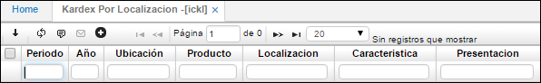
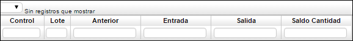
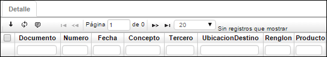
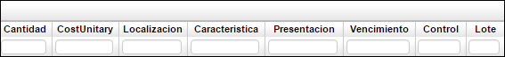

# Kardex por Localización - ICKL

**Periodo:** Mes de la consulta.  
**Año:** Año de la consulta.  
**Ubicación:** Número de ubicación de la empresa en donde se encuentra el producto.  
**Producto:** Código asignado al producto, anteriormente parametrizado en **BPRO**.  
**Característica:** Cualidad propia del producto.  
**Presentación:** Tipo de presentación del producto.  

**Control:** Número de serial o consecutivo asignado a productos que vende la empresa y poder así identificarlos y llevar un control sobre ellos.  
**Lote:** Lote especifico del producto.  
**Anterior:** Cantidad de productos anteriores.  
**Entrada:** Cantidad de productos que ingresan.  
**Salida:** Cantidad de productos que salen.  
**Saldo cantidad:** Cantidad de productos finales.  

Detalle de la aplicación Kardex por Localización.  

**Documento:** Nombre de documento parametrizado con anterioridad en la aplicación **BDOC**.  
**Número:** Número consecutivo del movimiento
**Ubicación:** Número de ubicación de la empresa en donde se encuentra el producto.  
**Fecha:** Fecha del día en que se realizó el movimiento.  
**Concepto:** Concepto del movimiento.  
**Tercero:** Tercero asociado al movimiento.
**Ubicación de destino:** Ubicación a donde será cargado el movimiento de productos.  
**Renglón:** Renglón de detalle asociado al movimiento.  
**Producto:** Código asignado al producto, anteriormente parametrizado en **BPRO**.  

**Cantidad:** Cantidad por producto.  
**Costo unitario:** Costo por unidad de producto.  
**Localización:** Identificación numérica de la localización de un producto.  
**Cantidad:** Cantidad de unidades utilizadas en el movimiento.  
**Característica:** Cualidad propia del producto.  
**Presentación:**  Tipo de presentación del producto.  
**Vencimiento:** Fecha de vencimiento del producto.  
**Control:** Número de serial o consecutivo asignado a productos que vende la empresa y poder así identificarlos y llevar un control sobre ellos.  
**Lote:** Lote especifico del producto.  

