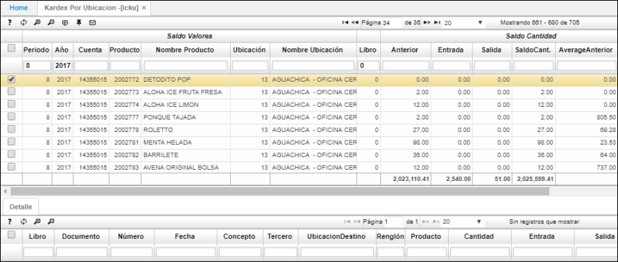

# Kardex por Ubicación - ICKU

La aplicación **ICKU** muestra la ubicación de donde se está realizando el kardex y el estado, esto permite tener un control de las ubicaciones y el estado de ellas. Igualmente, cuenta con subtotales en las columnas que sumen inventario de productos y afecten la cantidad de los mismos.  

