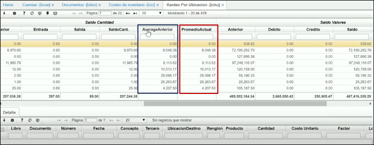

---

layout: default
title: Costos
permalink: /Operacion/scm/inventarios/icosto/icku
editable: si

---

# Kardex por Ubicación - ICKU

La aplicación **ICKU** muestra la ubicación de donde se está realizando el Kardex y el estado, esto permite tener un control de las ubicaciones y el estado de ellas. Igualmente, cuenta con subtotales en las columnas que sumen inventario de productos y afecten la cantidad de estos.  

En esta aplicación filtramos por periodo y año con el que ejecutamos el proceso realizamos en la aplicación [**ICCI - Costeo de inventario.**](http://docs.oasiscom.com/Operacion/scm/inventarios/icosto/icci)

A continuación nos dirigimos al campo _AverageAnterior._ 

En el campo _AverageAnterior_ se encuentra el promedio del periodo anterior que se está consultando. En el siguiente campo _PromedioActual_  se encuentra el promedio que el sistema genero luego de ejecutar el costeo.

Validada esta información nos dirigimos a la aplicación [IRCE - Costos Errados](http://docs.oasiscom.com/Operacion/scm/inventarios/ireporte/irce) alli verificamos datos erroneos.

