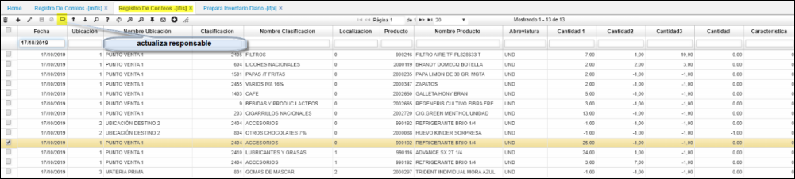
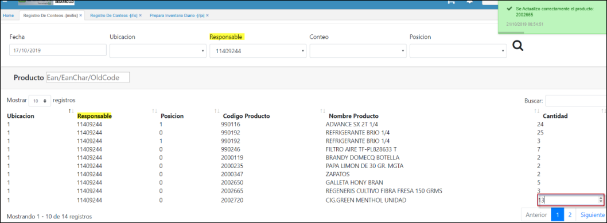
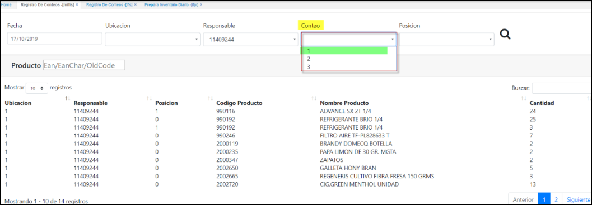
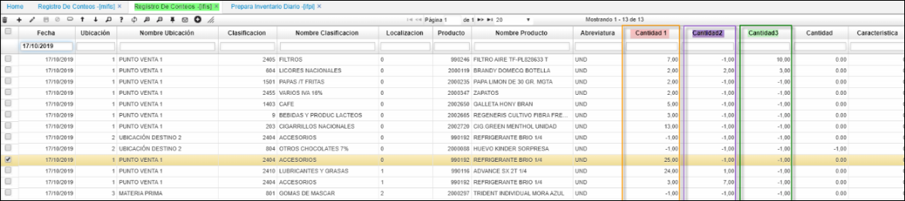
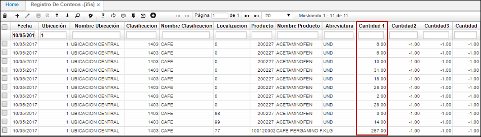
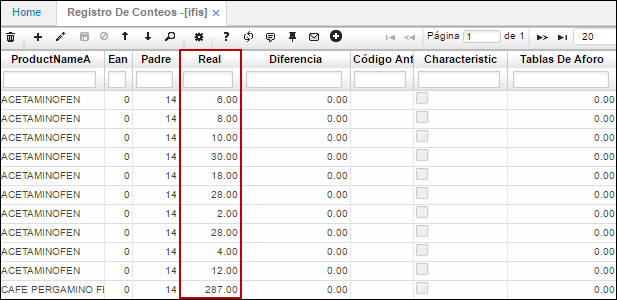

--- 
layout: default  
title: Registro de Conteos  
permalink: /Operacion/scm/inventarios/ifisico/mifis  
editable: si  
---

# Registro de Conteos - MIFIS   

Esta aplicación permite el registro de los diferentes conteos, presentando además los datos de la toma de cada registro como la fecha, ubicación del punto donde se realizó el conteo, cantidad del producto contado, y características inherentes a cada producto como presentación, vencimiento, control etc.   

En **MIFIS** se debe registrar los conteos realizados del inventario, al ingresar se debe consultar por fecha y ubicación.  
Desde el **IFIS**, se debe de actulizar el responsable, ejecutando el boton del maestro.   

  

Desde el **MIFIS** con el lector de código de barras; realiza el conteo o en su defecto lo realiza manual; campo cantidad el sistema realiza automático el guardado al cambiar el cursor como se ilustra.  

  

En el campo _Cantidad 1_ se ingresará por cada artículo el número de productos encontrados en el inventario realizado. Si el inventario lo va a realizar más de una persona, los usuarios ingresarán las cantidades en los campos _Cantidad 2_ y _Cantidad 3_. Se visualizan en el **IFIS**, como se ilustra.   

  

**IFIS**

  

**IMPORTANTE:**  
**La aplicacion MIFIS desempeña la misma funcion que el IFIS, conteo de inventarios.**  

Ingresadas las cantidades de cada artículo, nos dirigiremos a la aplicación [**IFCD - Calcula Diferencias**](http://docs.oasiscom.com/Operacion/scm/inventarios/ifisico/ifcd), la cual nos ayudará a calcular las diferencias de existencias encontradas por el sistema en su base de datos con las ingresadas por el usuario.  

## [Inventario Cíclico](http://docs.oasiscom.com/Operacion/scm/inventarios/ifisico/ifis#inventario-cíclico)

Generado anteriormente el proceso de la aplicación [**IFPI - Prepara Inventario Diario**](http://docs.oasiscom.com/Operacion/scm/inventarios/ifisico/ifpi#inventario-cíclico), procedemos a ingresar las cantidades de los productos inventariados en la aplicación IFIS - Registro de Conteos. Se consultará por fecha y ubicación, siendo estas, las mismas que se ingresaron en la generación del proceso en la aplicación  [**IFPI - Prepara Inventario Diario**](http://docs.oasiscom.com/Operacion/scm/inventarios/ifisico/ifpi#inventario-cíclico).  En dicha consulta, solo aparecerán los productos que clasifican en el rango indicado anteriormente en la generación del inventario cíclico así no se encuentren existencias de los productos.  

En el campo _Cantidad 1_ se ingresará por cada artículo el número de productos encontrados en el inventario realizado. Si el inventario lo va a realizar más de una persona, los usuarios ingresarán las cantidades en los campos _Cantidad 2_ y _Cantidad 3_. Estos datos corresponden a la información que se ingresó en la planilla descargada desde la aplicación [**IRIF - Plantilla Para Conteo Físico**](http://docs.oasiscom.com/Operacion/scm/inventarios/ifisico/irif).

Al ingresar un número en el campo _Cantidad 1_, es necesario dar click en el botón _Guardar_ de la barra de herramientas u oprimir la tecla _Enter_ para que el registro sea guardado.  

En el campo _Real_, se muestran las cantidades por producto que existen en el sistema.  

Ingresadas las cantidades de cada artículo, nos dirigiremos a la aplicación [**IFCD - Calcula Diferencias**](http://docs.oasiscom.com/Operacion/scm/inventarios/ifisico/ifcd), la cual nos ayudará a calcular las diferencias de existencias encontradas por el sistema en su base de datos con las ingresadas por el usuario.  

## [Validación de diferencias en inventario](http://docs.oasiscom.com/Operacion/scm/inventarios/ifisico/ifis#validación-de-diferencias-en-inventario)

Generado el proceso en la aplicación  [**IFCD - Calcula Diferencias**](http://docs.oasiscom.com/Operacion/scm/inventarios/ifisico/ifcd), en la aplicación IFIS - Registo de Conteos validaremos las diferencias de existencias calculadas por el sistema, estas se podrán ver en el campo _Diferencia_.  

Validadas las diferencias ingresaremos a la aplicación [**IFAJ - Genera Ajustes**](http://docs.oasiscom.com/Operacion/scm/inventarios/ifisico/ifaj), en donde se generará el proceso para que el sistema realice los ajustes correspondientes al inventario de acuerdo a las diferencias encontradas anteriormente.  
