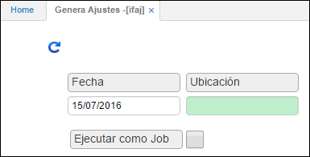

# Genera Ajustes - IFAC

Proceso que genera los ajustes para las diferencias encontradas. Estos ajustes no son procesados y deben confirmarse con sus causas en la pantalla de entradas o salidas por ajuste.  

Datos de entrada: Para la generación de este proceso se requieren los siguientes datos de entrada: fecha en la cual se realiza el ajuste y la ubicación donde se va a generar el proceso.  

