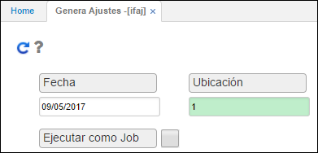

# Genera Ajustes - IFAJ

La aplicación **IFAJ**, permite generar los ajustes correspondientes al inventario realizado de acuerdo con las diferencias encontradas anteriormente al ejecutar la aplicación [**IFCD - Calcula Diferencias**](http://docs.oasiscom.com/Operacion/scm/inventarios/ifisico/ifcd). Estos ajustes son generados en estado _Activo_ en la aplicación [**IMOV - Movimiento de inventarios**](http://docs.oasiscom.com/Operacion/scm/inventarios/imovimient/imov), por lo cual, deben ser procesados tanto las entradas por ajuste como las salidas según corresponda.  

Para la generación de este proceso se ingresará la fecha en la cual se realizó el inventario y la ubicación donde se encuentran los artículos inventariados.  

Ingresados los datos damos click en el botón _Generar_ , el sistema arrojará un mensaje de control indicando que el proceso se generó satisfactoriamente.  

Generado el proceso, el sistema creará los documentos de ajuste en la aplicación [**IMOV - Movimiento de inventarios**](http://docs.oasiscom.com/Operacion/scm/inventarios/imovimient/imov) los cuales deben ser procesados, estos pueden ser documentos _EN - Entradas del inventario_ por concepto _EA - Entrada por ajuste_ o documentos _SA - Salidas del inventario_ por concepto _SA - Salida por ajuste_. 

