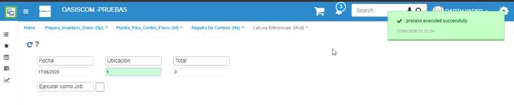

# Calcula Diferencias - IFCD

El proceso IFCD calcula las diferencias entre el conteo físico realizado por los usuarios y la cantidad real en inventarios dentro del sistema, las diferencias que sean encontradas se podrán ver reflejadas en la aplicación  [**IFIS - Registro de Conteos**](http://docs.oasiscom.com/Operacion/scm/inventarios/ifisico/ifis), en donde también deberán ser validadas para posteriormente realizar los ajustes correspondientes en el sistema.  

Se ingresarán los datos de fecha y ubicación.  

**Fecha:** ingresar la fecha en la que se realizó el inventario físico.  
**Ubicación:** seleccionar la ubicación en la que se encuentran los productos inventariados.  
**Total:** ingresar el número 0.  

Ingresados los datos damos click en el botón _Generar_  y el sistema arrojará un mensaje de control informando que el proceso fue ejecutado satisfactoriamente.  

Generado el proceso anterior, ingresaremos a la aplicación  [**IFIS - Registro de Conteos**](http://docs.oasiscom.com/Operacion/scm/inventarios/ifisico/ifis) en donde se validarán las diferencias de inventario encontradas por el sistema OasisCom, estas se podrán ver en el campo _Diferencia_.  

