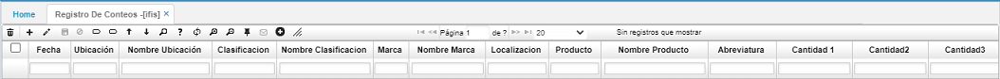
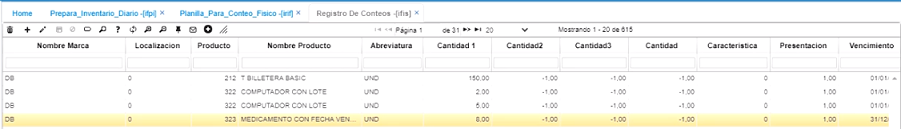
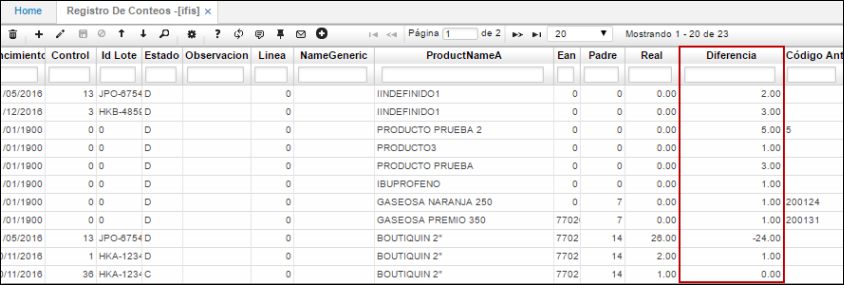

# Registro de Conteos - IFIS

Esta aplicación permite el registro de los diferentes conteos, presentando además los datos de la toma de cada registro como la fecha, ubicación del punto donde se realizó el conteo, cantidad del producto contado, y características inherentes a cada producto como presentación, vencimiento, control etc.  

## Inventario Periódico

Generado anteriormente el proceso de la aplicación [**IFPI - Prepara Inventario Diario**](http://docs.oasiscom.com/Operacion/scm/inventarios/ifisico/ifpi), se ingresará la información del inventario realizado en la aplicación IFIS - Registro de Conteos. Se consultará por fecha y ubicación, siendo estas, las mismas que se ingresaron en la generación del proceso en la aplicación  [**IFPI - Prepara Inventario Diario**](http://docs.oasiscom.com/Operacion/scm/inventarios/ifisico/ifpi).  

En el campo _Cantidad 1_ se ingresará por cada artículo el número de productos encontrados en el inventario realizado. Estos datos corresponden a la información que se ingresó en la planilla descargada desde la aplicación [**IRIF - Plantilla Para Conteo Físico**](http://docs.oasiscom.com/Operacion/scm/inventarios/ifisico/irif).  

Al ingresar un número en el campo _Cantidad 1_, es necesario dar click en el botón _Guardar_ de la barra de herramientas u oprimir la tecla _Enter_ para que el registro sea guardado.  

Ingresadas las cantidades de cada artículo, nos dirigiremos a la aplicación [**IFCD - Calcula Diferencias**](http://docs.oasiscom.com/Operacion/scm/inventarios/ifisico/ifcd), la cual nos ayudará a calcular las diferencias de existencias encontradas por el sistema en su base de datos con las ingresadas por el usuario.  

#### Validación de diferencias en inventario

Generado el proceso en la aplicación  [**IFCD - Calcula Diferencias**](http://docs.oasiscom.com/Operacion/scm/inventarios/ifisico/ifcd), en la aplicación IFIS - Registo de Conteos validaremos las diferencias de existencias calculadas por el sistema, estas se podrán ver en el campo _Diferencia_.  

Validadas las diferencias ingresaremos a la aplicación [**IFAJ - Genera Ajustes**](http://docs.oasiscom.com/Operacion/scm/inventarios/ifisico/ifaj), en donde se generará el proceso para que el sistema realice los ajustes correspondientes al inventario, de acuerdo, a las diferencias encontradas anteriormente.  

