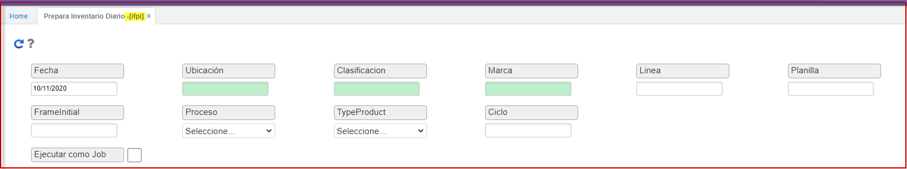
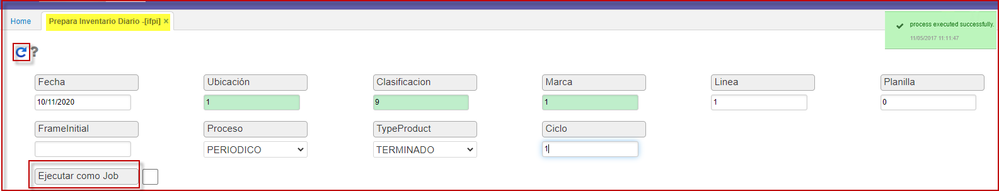
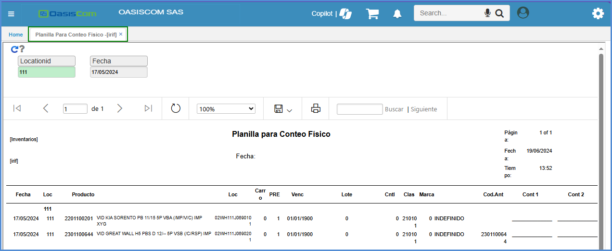
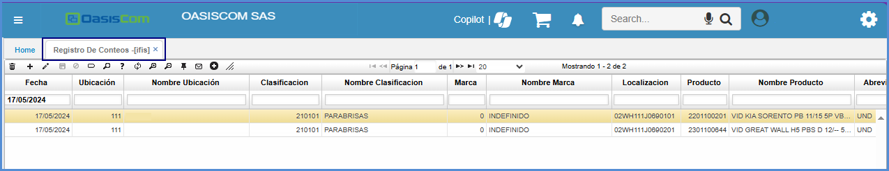
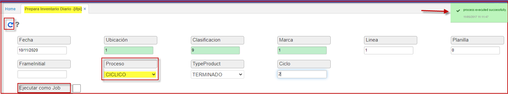
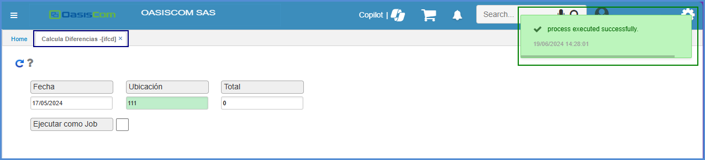
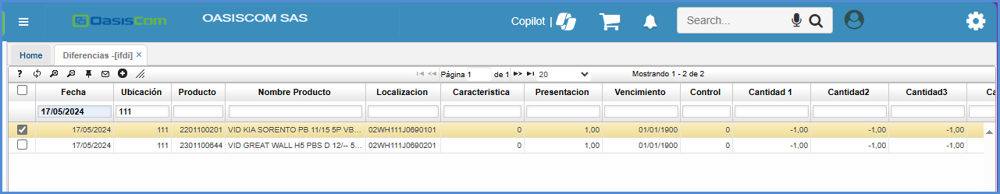
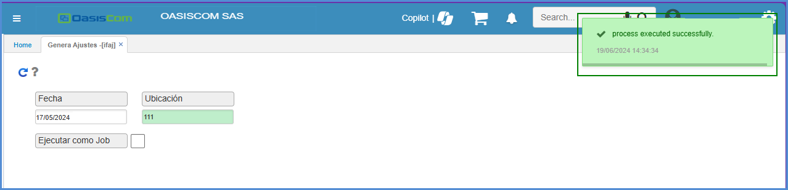
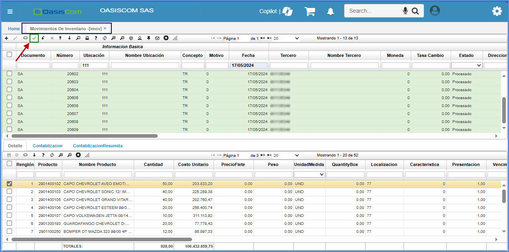

# Prepara Inventario Diario - IFPI

La aplicación **IFPI - Prepara Inventario Diario** es un proceso que genera un inventario diario para realizar los controles correspondientes.  

Ingresar al programa **IFPI - Prepara Inventario Diario** e ingresar los datos. 

>**Nota:** Este proceso se debe ejecutar el mismo día en que se vaya a realizar el inventario.

Para ejecutar el proceso de preparación de inventario periódico ingresamos los siguientes datos:  

| Campos | Descripción |
| --- | ----------- |
| Fecha         | Fecha actual en la que se va a realizar el inventario.     |
| Ubicación     | Ingresar o seleccionar del zoom la ubicación (bodega) en la cual se encuentran los productos.   |
| Clasificación | Datos parametrizables en [**BCLA - Clasificaciones**](https://docs.oasiscom.com/Operacion/common/bprodu/bcla) el cual posee zoom de ayuda.       |
| Marca         | Datos parametrizables en **BMAR - Marcas**.       |
| Línea         | Si el inventario se va a realizar por línea de producto, ingresar la línea correspondiente.|
| Planilla      | Esta debe encontrarse en 0, ya que el sistema lo genera automaticamente.|
|Frame Initial  | Indicar en que planilla inicial se desea los productos para el conteo.
| Proceso       | seleccionar de la lista desplegable la opción **_Periódico_**.|
| Type Product  | Seleccionar de la lista desplegable la opción **_Terminado_**.|
| Ciclo         | En la aplicación, cuenta con dos Ciclos, el cual dependiendo de cual se diligencia el formulario se adaptara a lo solicitado.|
| Localización  | Este permite elegir la localización el cual permite buscar por un valor estandar. |
| Id Responsable| Este campo cuenta con el campo **Zoom** para buscar el número del Responsable. |
 

Ingresados los datos, damos clic en el botón **_Generar_**  y el sistema arroja un mensaje indicando que el proceso se realizó satisfactoriamente.  

Luego de generar la planilla se puede consultar la planilla en el programa [**IRIF - Planilla Para Conteo Físico**](https://docs.oasiscom.com/Operacion/scm/inventarios/ifisico/irif) con los filtros 
de la ubicación y la fecha con la que se genero. 
Esta planilla es para poder imprimirla y en la columna cantidad se puedan registrar los conteos realizados. Para que salga la información se debe ejecutar el botón Generar .

Generado el proceso anterior , se procede a realizar el inventario en la aplicación [**IFIS - Registro de Conteos**](http://docs.oasiscom.com/Operacion/scm/inventarios/ifisico/ifis#inventario-periódico). En el programa [**IFIS - Registro de Conteos**](http://docs.oasiscom.com/Operacion/scm/inventarios/ifisico/ifis#inventario-periódico) se debe realizar la consulta por la fecha que se genero en el primer proceso.

En esta opción se deben registrar las unidades encontradas de cada producto, aparecen tres columnas **“Cantidad1”**, **“Cantidad2”**, **“Cantidad3**”. 

>**Nota:** Si se realiza un único conteo pueden registrar las unidades solo en el campo **“Cantidad1”**. 

Para el proceso **Ciclico** por medio de la aplicación **IFPI - Prepara Inventario Diario** se genera el inventario cíclico que tendrá en cuenta los rangos parametrizados anteriormente en la aplicación [**BRAN - Rangos**](https://docs.oasiscom.com/Operacion/common/btercer/bran). Este proceso se deberá generar un día antes de realizar el inventario.

Se debe ingresar en el campo **Ciclo:** el número del rango del cual se realiza inventario. Dicho número se parametrizó en aplicación [**BRAN - Rangos**](http://docs.oasiscom.com/Operacion/common/btercer/bran#inventario-cíclico) en el campo **_Id Rango_**.  

Luego de registrar las unidades encontradas, deben calcular las diferencias a través del proceso [**IFCD - Calcula Diferencias**](https://docs.oasiscom.com/Operacion/scm/inventarios/ifisico/ifcd), tener en cuenta que se debe generar con la misma fecha. 

Luego se ingresa al programa [**IFDI - Diferencias**](https://docs.oasiscom.com/Operacion/scm/inventarios/ifisico/ifdi) y consultar por la fecha. Verificar las diferencias calculadas por el sistema.

Si estas diferencias son reales pueden ingresar a la 
opción ifaj, donde el sistema les va a crear movimientos de entrada o de salida por ajuste 
en el programa [**IMOV - Movimiento de Inventario**](https://docs.oasiscom.com/Operacion/scm/inventarios/imovimient/imov).
A través del proceso [**IFAJ - Genera Ajustes**](https://docs.oasiscom.com/Operacion/scm/inventarios/ifisico/ifaj) el sistema va a crear movimientos por ajuste en el programa [**IMOV - Movimiento de Inventario**](https://docs.oasiscom.com/Operacion/scm/inventarios/imovimient/imov) ya sea salidas o entradas por ajuste. Esto dependiendo si en el cálculo de diferencias se identifican sobrantes o faltantes.

Por último, se ingresa al [**IMOV - Movimiento de Inventario**](https://docs.oasiscom.com/Operacion/scm/inventarios/imovimient/imov) y consultar los documentos en estado activo donde encontraran los movimientos de ajuste, se debe editar el encabezado o maestro del documento y colocar el tercero.
Se verifica la información del detalle y se procesa con el botón **procesar** .

Se puede verificar el saldo del inventario luego de procesar los movimientos de inventario a través de los reportes de inventarios en las aplicaciones [**ISPB - Saldos por Bodega**](https://docs.oasiscom.com/Operacion/scm/inventarios/isaldo/ispb) y [**ICKU - Kardex Por Ubicación**](https://docs.oasiscom.com/Operacion/scm/inventarios/icosto/icku).

 

