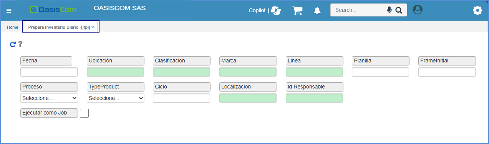
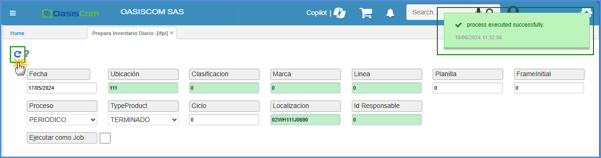
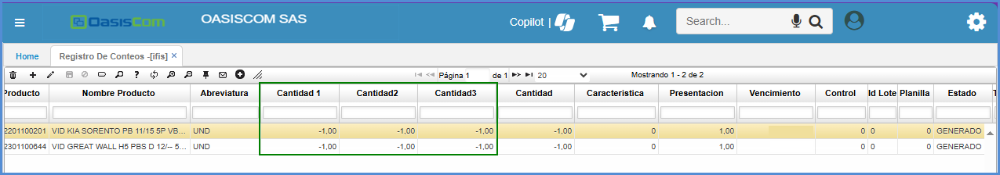

# Prepara Inventario Diario - IFPI

Proceso que genera un inventario diario para realizar los controles correspondientes.  

* [Inventario Periódico](http://docs.oasiscom.com/Operacion/scm/inventarios/ifisico/ifpi#inventario-periódico)
* [Inventario Cíclico](http://docs.oasiscom.com/Operacion/scm/inventarios/ifisico/ifpi#inventario-cíclico)

## [Inventario Periódico](http://docs.oasiscom.com/Operacion/scm/inventarios/ifisico/ifpi#inventario-periódico)

Mediante la aplicación **IFPI** se genera el inventario diario a realizar. Este proceso se debe ejecutar el mismo día en que se vaya a realizar el inventario.

Para ejecutar el proceso de preparación de inventario periódico ingresamos los siguientes datos:  

**Fecha:** fecha actual en la que se va a realizar el inventario.  
**Ubicación:** ingresar o seleccionar del zoom la ubicación (bodega) en la cual se encuentran los productos.  
**Clasificación:** datos parametrizables en **BCLA**; posee zoom de ayuda.  
**Marca:** datos parametrizables en **BMAR**; posee zoom de ayuda.  
**Línea:** si el inventario se va a realizar por línea de producto, ingresar la línea correspondiente.  
**Proceso:** seleccionar de la lista desplegable la opción _Periódico_.  
**Tipo Producto:** seleccionar de la lista desplegable la opción _Terminado_.  

Ingresados los datos, damos clic en el botón _Generar_  y el sistema arrojará un mensaje indicando que el proceso se realizó satisfactoriamente.  

Generado el anterior proceso, procederemos a realizar el inventario periódico en la aplicación [**IFIS - Registro de Conteos**](http://docs.oasiscom.com/Operacion/scm/inventarios/ifisico/ifis#inventario-periódico), para ello, el sistema cuenta con una planilla para conteo físico, la cual se puede descargar en la aplicación [**IRIF - Plantilla Para Conteo Físico**](http://docs.oasiscom.com/Operacion/scm/inventarios/ifisico/irif). En dicha planilla se podrán observar los productos a los cuales se les realizará inventario de acuerdo con los filtros de consulta, igualmente, cuenta con espacios para que los usuarios ingresen las cantidades de productos por cada uno.  

## [Inventario Cíclico](http://docs.oasiscom.com/Operacion/scm/inventarios/ifisico/ifpi#inventario-cíclico)

Por medio de la aplicación IFPI se genera el inventario cíclico que tendrá en cuenta los rangos parametrizados anteriormente en la aplicación [**BRAN - Rangos**](http://docs.oasiscom.com/Operacion/common/btercer/bran#inventario-cíclico). Este proceso se deberá generar un día antes de realizar el inventario.  

Para ejecutar el proceso de preparación de inventario cíclico ingresamos los siguientes datos:  

**Fecha:** ingresar fecha del día el cual se va a realizar el inventario físico.  
**Ubicación:** ingresar o seleccionar del zoom la ubicación (bodega) en la cual se encuentran los productos.  
**Clasificación:** datos parametrizables en **BCLA**; posee zoom de ayuda.  
**Marca:** datos parametrizables en **BMAR**; posee zoom de ayuda.  
**Proceso:** seleccionar de la lista desplegable la opción _Cíclico_.  
**Tipo Producto:** seleccionar de la lista desplegable la opción _Terminado_.  
**Ciclo:** ingresar el número del rango del cual se realizará inventario. Dicho número se parametrizó en aplicación:     [**BRAN - Rangos**](http://docs.oasiscom.com/Operacion/common/btercer/bran#inventario-cíclico) en el campo _Id Rango_.  

Ingresados los datos, damos clic en el botón _Generar_  y el sistema arrojará un mensaje indicando que el proceso se realizó satisfactoriamente.  

  

Generado el anterior proceso, procederemos a realizar el inventario cíclico en la aplicación [**IFIS - Registro de Conteos**](http://docs.oasiscom.com/Operacion/scm/inventarios/ifisico/ifis#inventario-cíclico), para ello, el sistema cuenta con una planilla para conteo físico, la cual se puede descargar en la aplicación [**IRIF - Plantilla Para Conteo Físico**](http://docs.oasiscom.com/Operacion/scm/inventarios/ifisico/irif). En dicha planilla se podrán observar los productos a los cuales se les realizará inventario de acuerdo con los filtros de consulta, igualmente, cuenta con espacios para que los usuarios ingresen las cantidades de productos por cada uno.   

