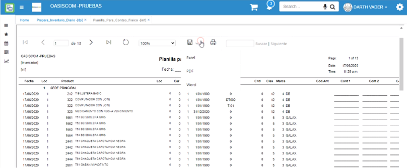

# Planilla Para Conteo Físico - IRIF

En la aplicación IRIF se podrá descargar la planilla para conteo físico que servirá de referencia al realizar el inventario periódico, en la planilla se podrán observar los productos a los cuales se les realizará inventario de acuerdo al filtro de consulta, igualmente, cuenta con espacios en donde los usuarios podrán ingresar las cantidades de productos por cada uno que se encuentren en el inventario.  

Para consultar la planilla de conteo, filtraremos por la ubicación en donde se encuentran los productos y la fecha en la cual se realiza el inventario. Dicha ubicación y fecha deberán ser las mismas con las que se generó el inventario en la aplicación [**IFPI - Prepara Inventario Diario**](http://docs.oasiscom.com/Operacion/scm/inventarios/ifisico/ifpi).  

Al consultar dando clic en el botón _Generar_ , el sistema arrojará la planilla, la cual cuenta con campos como _Fecha_, _Localización_, _Código del producto_, _Nobre del producto_, si tienen _Vencimiento_, si tienen _Lote_, _Clasificación_, _Marca_ y tres campos llamados: _Cont 1_, _Cont 2_, _Cont 3_ en los cuales los usuarios reponsables de realizar el inventario ingresarán las cantidades contadas por producto. La planilla podrá ser descargada en formato de Excel, PDF o Word).  El sistema sólo va a generar productos que tengan inventario en ese momento en la ubicación.  

Esta planilla facilitará el ingreso de información en la aplicación [**IFIS - Registro de Conteos**](http://docs.oasiscom.com/Operacion/scm/inventarios/ifisico/ifis) en la cual se debe registrar el conteo de los productos.  

