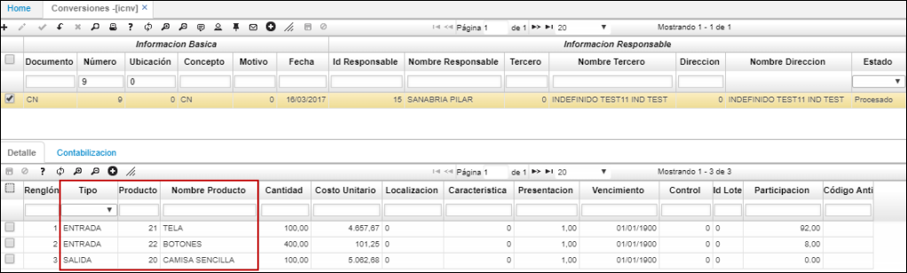
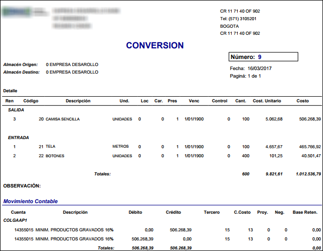

# ICNV - Conversiones

La aplicación ICNV permite armar los kit que emplearé en la producción de un producto.  En donde se registrarán entradas, las cuales harán referencia a los componentes del producto y se registrarán así mismo las salidas, que son el producto final.  

A continuación, vemos un ejemplo de un kit compuesto por tela y botones representando las entradas, dejando como salida una camisa sencilla.  

Para armar un kit

## [Vista previa]()

La aplicación ICNV cuenta con una vista previa que permite ver las entradas y salidas de la conversión de producto. Para acceder a ella, seleccionamos un registro del maestro y damos click en el botón .  

Es posible descargar el reporte en formato Excel, PDF o Word.  

