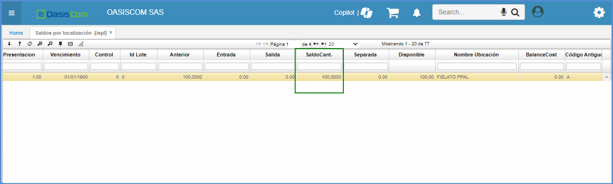
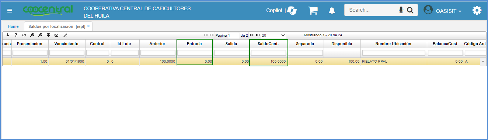

# Conversiones - ICNV

La aplicación **ICNV** permite armar los kits que se emplea en la producción de un producto.  En donde se registran entradas, las cuales harán referencia a los componentes del producto y se registran así mismo las salidas, que son el producto final.  

- [Proceso de Conversiones](#proceso-de-conversiones)
- [Armado](#armado)
- [Desarmado](#desarmado)
* [Pestaña Contabilización Resumida](#pestaña-contabilización-resumida)

## [Proceso de Conversiones](v#proceso-de-conversiones)

Se debe ingresar a la aplicación [**BDOC - Documento**](http://docs.oasiscom.com/Operacion/common/bsistema/bdoc) se debe filtrar por el número de documento **CN** de *conversiones* de inventario y se valida que el campo contabilidad esté en la opción suma y el campo inventario esté en resta. 

## [Armado](#armado)

A continuación, se visualiza un ejemplo de un kit compuesto por tela y botones representando las entradas, dejando como salida una camisa sencilla.

Se ingresa a la aplicación **ICNV** crear un nuevo registro.

En el campo *documento* seleccionar **CN** que corresponde a conversiones de inventario, *concepto,* nuevamente **CN** de conversiones de inventario y en el campo *ID* responsables, se escoge en el ZOOM la persona que corresponda, se guarda el maestro. 

En el detalle se adiciona un nuevo registro, en el campo tipo se escoge la opción de entrada o una salida, en este caso se arma un paquete (camisa), para esto se requiere los insumos los cuales se va a trabajar como tela y botones por lo tanto se hará una salida del producto. En este campo se selecciona el producto que corresponda, en este caso botones y cantidad que se necesita para armar las camisas que se requieren. 

Antes de continuar diligenciando el registro se debe ir a la aplicación [**ISPL**](http://docs.oasiscom.com/Operacion/scm/inventarios/isaldo/ispl),  en esta aplicación se verifica cantidades de este producto, si hay stock disponible. 

Luego de verificar el producto en esta aplicación, en la aplicación **ICNV** se diligencia la cantidad que corresponde y se ejecuta clic para guardar  cambios.  

Ahora se agrega otro producto el cual se requiere para armar nuestro producto final. En el campo tipo también se selecciona salida,  en el campo producto en este caso se elige tela, antes de diligenciar la cantidad se debe ir a la aplicación **ISPL** para verificar stock disponible.  

Luego de verificar el producto en esta aplicación, en la aplicación **ICNV** se diligencia la cantidad que corresponde y se ejecuta clic  para guardar cambios.

El campo costo unitario en los dos productos está en cero, este campo se diligenciará automáticamente cuando se procese el registro, pero se debe tener en cuenta que el costo unitario de estos dos productos suman el costo unitario del producto final.  

Se adiciona otra fila en el detalle y en el campo tipos se selecciona entrada porque el producto que se va a adicionar es el resultado de los productos anteriormente seleccionados.  

En el campo producto se selecciona  el producto final,en este caso "camisa sencilla", antes de colocar la cantidad se verifica en la aplicación [**ISPL**](http://docs.oasiscom.com/Operacion/scm/inventarios/isaldo/ispl) para verificar sus cantidades, se filtra por el código y se dirige al campo saldo cantidad.  

Luego de verificar el producto en esta aplicación, en la aplicación **ICNV** se diligencia la cantidad que corresponde y dase ejecuta clic  para guardar cambios.

El costo unitario de todos los productos está en cero, se procesa  el registro y se valida que se allá dado el costo unitario de cada producto. El costo del último producto es la suma de nuestros dos productos anteriores, es decir la suma de los insumos.

Se ingresa a la aplicación [**ISPL**](http://docs.oasiscom.com/Operacion/scm/inventarios/isaldo/ispl) se refresca, se verifica cantidades del producto final y materia prima que se utilizo para verificar si estas cantidades variaron al momento de realzar el producto final.

Para este proceso, también se tiene en cuenta la creación del campo **Factor**

Este campo cuenta con una configuración el cual permite modificarse ahí mismo en el detalle dado caso que entren conversiones nuevas.

Este campo toma el promedio de los productos de acuerdo a la ubicación. 

## [Desarmado](#desarmado)

Se ingresa a la aplicación **ICNV** crear un nuevo registro **+.**

En el campo *documento* seleccionar **CN** que corresponde a conversiones de inventario, *concepto,* nuevamente **CN** de conversiones de inventario y en el campo *ID* responsables, se escoge en el ZOOM la persona que corresponda, se guarda el maestro. 

En el detalle se adiciona un nuevo registro, es importante que se tenga en cuenta que se va a desarmar el paquete que se creó anteriormente en el armado.  

Para finalizar se añade otra fila en el detalle, pero esta vez no se creará una entrada sino una salida, debido a que este producto era el resultado de los insumos. Se selecciona el producto, en este caso es una “camisa sencilla”, se diligencia la cantidad que corresponde y se guarda . 

Antes de procesar, se debe verificar las cantidades que se tienen por cada producto en la aplicación ISPL, se filtra por el código del producto; allí, se deben mirar las casillas saldo, cantidad y entrada. El campo entrada se encuentra en cero, se debe repetir este proceso para cada uno de los insumos, verificando que el campo entrada se encuentre en cero. 

Luego de verificar el producto en esta aplicación, en la aplicación **ICNV** se observa al detalle en el campo participación, aquí se debe colocar el porcentaje de participación que tuvieron en la elaboración del paquete “camisa sencilla”, en este caso la participación del producto tela en el producto final fue del 92%, el de botones del 8%, la suma de estos porcentajes debe dar el 100%. Diligenciados estos campos ya se puede procesar el documento. 

Se reversa a la aplicación [**ISPL**](http://docs.oasiscom.com/Operacion/scm/inventarios/isaldo/ispl) allí se validan los saldos de los productos que se hayan afectado correctamente.  

## [**Pestaña Contabilización Resumida**](#pestaña-contabilización-resumida)

Se crea la pestaña **“contabilización resumida”** donde se **totalizan** los valores de las cuentas parametrizadas.  

 

