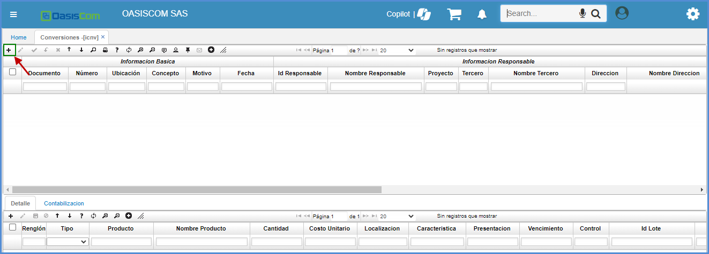
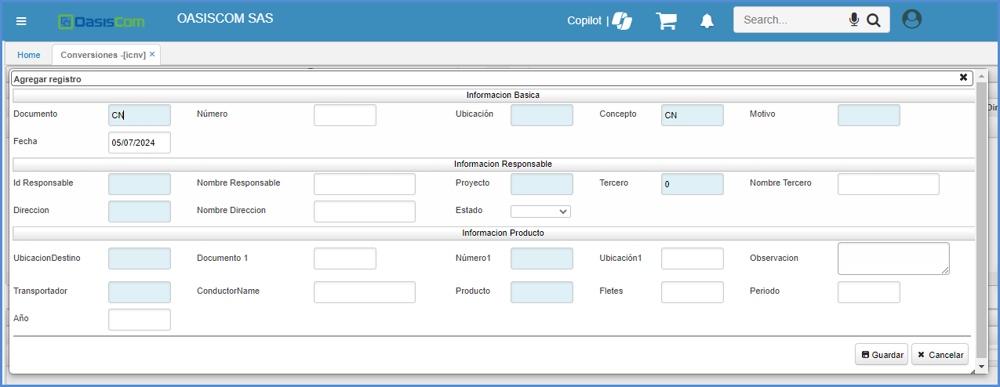
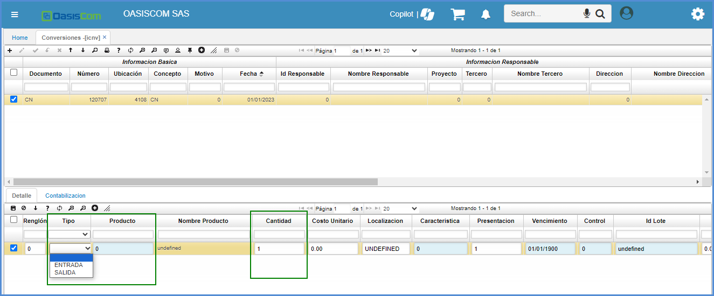
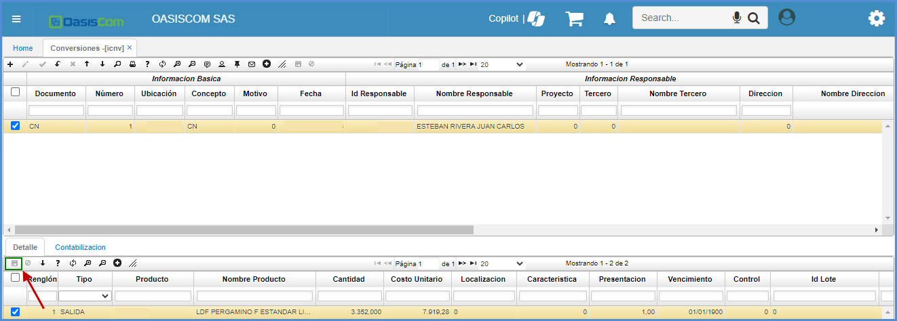
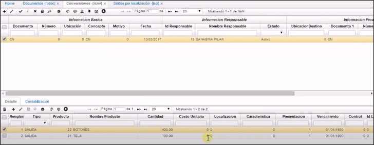

# Conversiones - ICNV

La aplicación **ICNV** permite armar los kit que emplearan en la producción de un producto.  En donde se registran entradas, las cuales harán referencia a los componentes del producto y se registran así mismo las salidas, que son el producto final.  

* [**Conversiones**](http://docs.oasiscom.com/Operacion/scm/inventarios/imovimient/icnv#conversiones)
* [**Pestaña Contabilización Resumida**](http://docs.oasiscom.com/Operacion/scm/inventarios/imovimient/icnv#pestaña-contabilización-resumida)
* [**Vista previa**](http://docs.oasiscom.com/Operacion/scm/inventarios/imovimient/icnv#vista-previa)

## [**Conversiones**](http://docs.oasiscom.com/Operacion/scm/inventarios/imovimient/icnv#conversiones)

Antes de relizar este proceso se debe ingresar a la aplicación [**BDOC - Documento**](http://docs.oasiscom.com/Operacion/common/bsistema/bdoc) se debe filtrar por el número de documento **CN** de *conversiones* de inventario y se valida el campo contabilidad este en la opción suma y al campo inventario este en resta. 

A continuación, vemos un ejemplo de un kit compuesto por tela y botones representando las entradas, dejando como salida una camisa sencilla.

Ingresamos a la aplicación **ICNV** crear un nuevo registro **+.**

En el campo *documento* seleccionar **CN** que corresponde a conversiones de inventario, *concepto,* nuevamente **CN** de conversiones de inventario y en el campo *ID* responsables, se escoge en el ZOOM  la persona que corresponda, se guarda el maestro. 

En el detalle adicionamos un nuevo registro, en el campo tipo se escoge la opción de entrada o una salida, en este caso se armar un paquete (camisa), para esto se requiere los insumos los cuales se va a trabajar como tela y botones por lo tanto se hará una salida del producto. En este campo se selecciona el producto que corresponda, en este caso botones y cantidad que se necesita para armar las camisas que se requieren. 

Antes de continuar diligenciando el registro se debe ir a la aplicación [**ISPL**](http://docs.oasiscom.com/Operacion/scm/inventarios/isaldo/ispl),  en esta aplicación verificamos cantidades de este producto, si hay stock disponible. 

Luego de verificar el producto en esta aplicación, en la aplicación **ICNV** se diligencia la cantidad que corresponde y damos clic guardamos  cambios.  

Ahora se agrega otro producto el cual se requiere para armar nuestro producto final. En el campo tipo también se selecciona salida,  en el campo producto en este caso se elige tela, antes de diligenciar la cantidad se debe ir a la aplicación ISPL para verificar stock disponible.  

Luego de verificar el producto en esta aplicación, en la aplicación **ICNV** se diligencia la cantidad que corresponde y damos clic guardamos cambios.

El campo costo unitario en los dos productos está en cero, este campo se diligenciara automáticamente cuando se procese el registro, pero se debe tener en cuenta que el costo unitario de estos dos productos suman el costo unitario del producto final.  

Adicionamos otra fila en el detalle y en el campo tipos se selecciona entrada porque el producto que vamos adicionar es el resultado de los productos anteriormente seleccionados.  

En el campo producto seleccionamos el producto final,en este caso "camisa sencilla", antes de colocar la cantidad verificamos en la aplicación [**ISPL**](http://docs.oasiscom.com/Operacion/scm/inventarios/isaldo/ispl) para verificar sus cantidades, filtramos por el código y nos dirigimos al campo saldo cantidad.  

Luego de verificar el producto en esta aplicación, en la aplicación **ICNV** se diligencia la cantidad que corresponde y damos clic guardamos cambios.

El costo unitario de todos los productos está en cero, procesamos  el registro y se valida que se allá dado el costo unitario de cada producto. El costo del último producto es la suma de nuestros dos productos anteriores, es decir la suma de los insumos.

Nos dirigimos a la aplicación [**ISPL**](http://docs.oasiscom.com/Operacion/scm/inventarios/isaldo/ispl) refrescamos, verificamos cantidades del producto final y materia prima que se utilizo para verificar si estas cantidades variaron al momento de realzar el producto final.

## [**Pestaña Contabilización Resumida**](http://docs.oasiscom.com/Operacion/scm/inventarios/imovimient/icnv#pestaña-contabilización-resumida)

Se crea la pestaña “contabilización resumida” donde se **totalizan** los valores de las cuentas parametrizadas.  
 

## [Vista previa](http://docs.oasiscom.com/Operacion/scm/inventarios/imovimient/icnv#vista-previa)

La aplicación ICNV cuenta con una vista previa que permite ver las entradas y salidas de la conversión de producto. Para acceder a ella, seleccionamos un registro del maestro y damos click en el botón .  

Es posible descargar el reporte en formato Excel, PDF o Word.  

