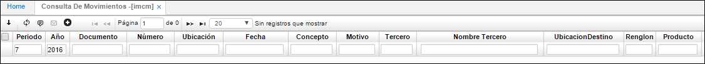
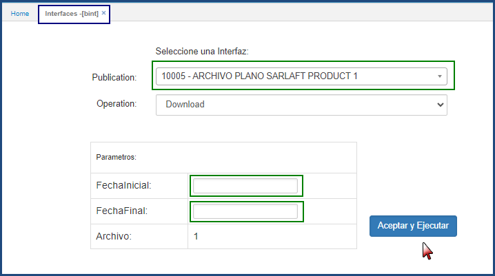
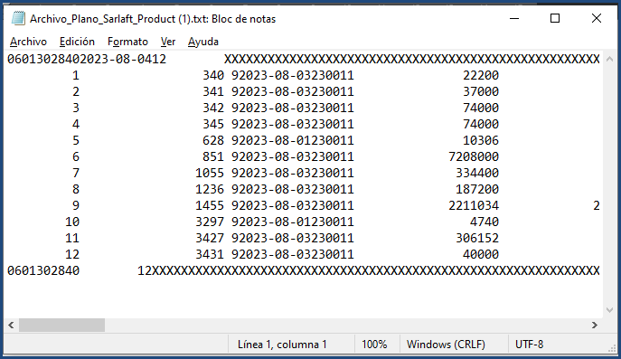

# Consulta de Movimientos - IMCM

Aplicación que permite la consulta de los movimientos realizados en el módulo de inventarios.  

**Periodo:**  Hace referencia al mes de la consulta.  
**Año:** Hace referencia al año de la consulta.  
**Documento:** Nombre de documento parametrizado con anterioridad en la aplicación **BDOC**.  
**Número:** Numero consecutivo del movimiento.  
**Ubicaci** Fecha del día en que se realizó el movimiento.  
**Concepto:** Concepto del movimiento.  
**Motivo:** Motivo del movimiento.  
**Tercero:** Tercero asociado al movimiento.  
**Nombre de Tercero:** Nombre de tercero asociado al movimiento.  
**Ubicación de destino:** Ubicación a donde será cargado el movimiento de productos.  
**Renglón:** Renglón de detalle asociado al movimiento.  
**Producto:** Código asignado al producto, anteriormente parametrizado en **BPRO**.  
**Nombre del Producto:** Nombre de producto.  
**Cantidad:** Cantidad por producto.  
**Costo unitario:** Costo por unidad de producto.  
**Localización:** Identificación numérica de la localización de un producto.  
**Presentación:** Forma de presentación del producto 
**Vencimiento:** Fecha de vencimiento del producto.  
**Control:** Número de serial o consecutivo asignado a productos que vende la empresa y poder así identificarlos y llevar un control sobre ellos.  
**Lote:** Si los productos pertenecen a un lote en específico.  

# ARCHIVO SARLAFT DEL ANEXO 3 - IUAF

Creación de la publicación para descargar la información de acuerdo con la estructura del anexo 3 de la UAIF “Reporte de transacciones de los clientes de proveedores de servicios de activos virtuales”. El Archivo tipo texto que el Proveedor de Servicios de Activos Virtuales (PSAV) debe enviar a la UIAF, contiene información sobre cada una de las transacciones. Desde la aplicación del **BINT-Interfaces**

Indicar la fecha inicial y final del rango para la consulta de la información de proveedores, al dar clic en el botón aceptar y ejecutar esta descarga un archivo plano txt con la información parametrizada.

