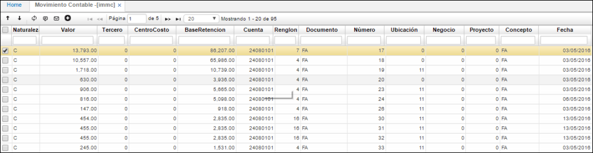

# Movimiento Contable - IMMC

Aplicación que permite la consulta de movimientos contables.  

**Naturaleza:** Naturaleza de la cuenta asociada a el movimiento (D o C).  
**Valor:**  Monto del movimiento realizado.  
**Tercero:** Número de identificación del tercero asociado a un movimiento contable.  
**Centro de Costo:** Centro de costo parametrizado anteriormente.  
**Base Retención:** Valor de Base para realizar la retención, si aplica.  
**Cuenta:** Número de cuenta.  
**Renglón:** Renglón asociado al movimiento.  
**Documento:** Nombre de documento del movimiento.  
**Número:** Numero consecutivo del movimiento.  
**Ubicación:** Número de ubicación asociado al movimiento.  
**Proyecto:** Id del proyecto asociado al movimiento, si aplica.  
**Concepto:** Concepto parametrizado y asociado al movimiento.  
**Fecha:** Fecha de generación del movimiento.  

