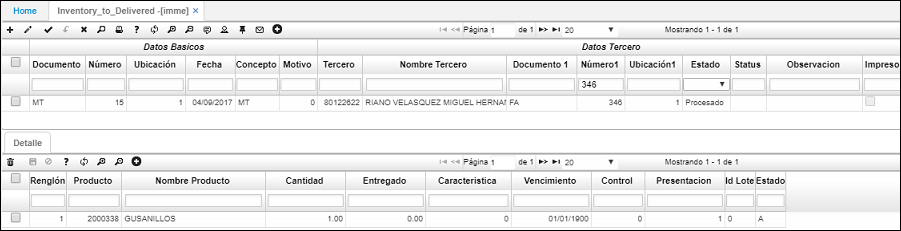

# IMME - Inventario a entregar

La aplicación IMME permite realizar control de la mercancia pendiente por entregar. En el momento de crear facturas desde la opción [**JFAC - Facturas**](http://docs.oasiscom.com/Operacion/scm/pos/jcajero/jfac), si el producto a facturar tiene el campo _Pendiente_ activo, indica que dicho producto no pudo ser entregado y se creará un documento en la opción **IMME** indicando que está pendiente de entrega.  

* JFAC - Facturas

Al procesar la factura en la aplicación JFAC, se creará el documento _MT - Mercancía por entregar_ en la aplicación IMME. Allí filtraremos en el campo _Número1_ por el número de la factura creada en JFAC.

