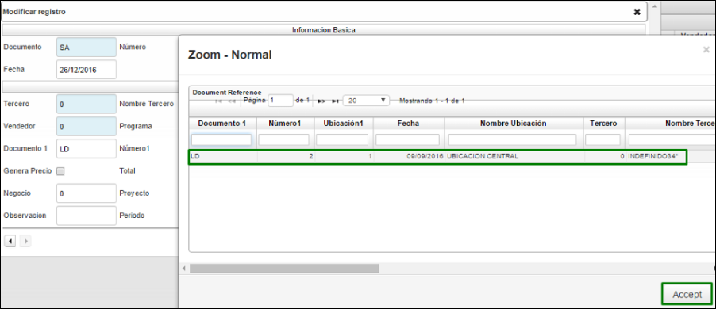
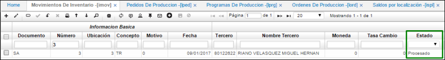

# MOVIMIENTOS DE INVENTARIO - IMOV

Esta aplicación permite la ejecución de los principales movimientos que afectan el inventario, tales como entradas por compra, salidas por remisiones, salidas por consumo.  

**Documento:** Nombre de documento parametrizado con anterioridad en la aplicación **BDOC**.  
**Número:** Numero consecutivo del movimiento.  
**Ubicación:** Número de ubicación de la empresa en donde se encuentra el producto.  
**Concepto:** Concepto del movimiento.  
**Motivo:** Motivo del movimiento.  
**Fecha:** Fecha en la que se realizará el movimiento.  
**Tercero:** Tercero asociado al movimiento.  
**Nombre de Tercero:** Nombre de tercero asociado al movimiento.  
**Moneda:** Tipo de moneda que se utilizara en el movimiento de inventarios.  
**Estado:** Estado en el que se encuentra el movimiento (Activo, procesado, Anulado).  
**Vendedor:** Tercero que está registrado como vendedor.  
**Tipo de precio:** Tipo de precio registrado con anterioridad en la aplicación **FBTP**.  
**Ubicación de destino:** Ubicación a donde será cargado el movimiento de productos.  

En el detalle:

**Renglón:** Renglón de detalle asociado al movimiento.  
**Producto:** Código asignado al producto, anteriormente parametrizado en **BPRO**.  
**Nombre del Producto:** Nombre de producto.  
**Cantidad:** Cantidad por producto.  
**Costo unitario:** Costo por unidad de producto.  
**Unidad Medida:** Hace referencia a la unidad de medida del producto ejemplo, unidad.  
**Localización:** Identificación numérica de la localización de un producto.  
**Característica:** Código de la característica que se puede atribuir al producto.  
**Presentación:** Forma de presentación del producto.  
**Vencimiento:** Fecha de vencimiento del producto.  
**Control:** Número de serial o consecutivo asignado a productos que vende la empresa y poder así identificarlos y llevar un control sobre ellos.  
**Lote:** Si los productos pertenecen a un lote en específico.  

## PRODUCCIÓN

Una vez validada la información del pedido se procesa el documento y se realiza un traslado de los insumos a la bodega requerida, para realizar este movimiento se debe ingresar a la aplicación _IMOV – movimientos de inventarios_.  

-	Documento: SA correspondiente a salida de inventario  
-	Ubicación: 3 correspondiente a la ubicación de donde saldrá la mercancía  
-	Concepto: TR correspondiente a traslado  
-	Tercero: Tercero correspondiente  
-	Ubicación Destino: 1 La ubicación a la que se requiere llevar la mercancía  
-	Documento1: LD Documento del pedido creado automáticamente en **LPED**  
-	Número1: 2 Número del pedido correspondiente al campo anterior  
-	Ubicación1: 1 Ubicación del pedido correspondiente al campo anterior  

Cabe resaltar que, si al momento de realizar este registro no recordamos el número del pedido, en el campo número 1 se puede realizar doble clic y el sistema abre una ventana emergente con los pedidos relacionados a ese tercero y en esa respectiva ubicación:

Se da clic en el botón aceptar y el sistema nos arroja el 2 en el campo número1.  

Al guardar el registro el sistema nos arroja automáticamente el detalle de acuerdo al pedido generado anteriormente, cabe resaltar que para que el sistema realice esto es necesario diligenciar los campos de color naranja de la imagen anterior para identificar a que pedido está asociado.

Se procesa el registro   

