---

layout: default
title: Movimientos de inventario
permalink: /Operacion/scm/inventarios/imovimient/imov
editable: si

---

# Movimientos de Inventario - IMOV

**Menú**

>+ [**IMOV - Movimientos de inventario**](http://docs.oasiscom.com/Operacion/scm/inventarios/imovimient/imov#imov---movimientos-de-inventario)  
>+ [**Creación Entradas y Salidas de inventario**](http://docs.oasiscom.com/Operacion/scm/inventarios/imovimient/imov#creación-entradas-y-salidas-de-inventario)  
>>* [**Entradas de Inventario**](http://docs.oasiscom.com/Operacion/scm/inventarios/imovimient/imov#entradas-de-inventario)  
>>* [**Salidas de Inventario**](http://docs.oasiscom.com/Operacion/scm/inventarios/imovimient/imov#salidas-de-inventario)  
>+ [**Producción**](http://docs.oasiscom.com/Operacion/scm/inventarios/imovimient/imov#producción)  
>+ [**Inventario Periódico e Inventario Cíclico**](http://docs.oasiscom.com/Operacion/scm/inventarios/imovimient/imov#inventario-periódico-e-inventario-cíclico)  
>+ [**Generación de Ajuste al Costo**](http://docs.oasiscom.com/Operacion/scm/inventarios/imovimient/imov#generación-de-ajuste-al-costo)  
>+ [**Ingreso de mercancía importada**](http://docs.oasiscom.com/Operacion/scm/inventarios/imovimient/imov#ingreso-de-mercancía-importada)  
>+ [**Salida de inventario por una orden de compra**](http://docs.oasiscom.com/Operacion/scm/inventarios/imovimient/imov#salida-de-inventario-por-una-orden-de-compra)

## [**IMOV - Movimientos de inventario**](http://docs.oasiscom.com/Operacion/scm/inventarios/imovimient/imov#imov---movimientos-de-inventario)

Esta aplicación permite la ejecución de los principales movimientos que afectan el inventario, tales como: entradas por compra, salidas por remisiones, salidas por consumo.  

**Documento:** Nombre de documento parametrizado con anterioridad en la aplicación **BDOC**.  
**Número:** Numero consecutivo del movimiento.  
**Ubicación:** Número de ubicación de la empresa en donde se encuentra el producto.  
**Concepto:** Concepto del movimiento.  
**Motivo:** Motivo del movimiento.  
**Fecha:** Fecha en la que se realizará el movimiento.  
**Tercero:** Tercero asociado al movimiento.  
**Nombre de Tercero:** Nombre de tercero asociado al movimiento.  
**Moneda:** Tipo de moneda que se utilizara en el movimiento de inventarios.  
**Estado:** Estado en el que se encuentra el movimiento (Activo, procesado, Anulado).  
**Vendedor:** Tercero que está registrado como vendedor.  
**Tipo de precio:** Tipo de precio registrado con anterioridad en la aplicación **FBTP**.  
**Ubicación de destino:** Ubicación a donde será cargado el movimiento de productos.  

En el detalle:

**Renglón:** Renglón de detalle asociado al movimiento.  
**Producto:** Código asignado al producto, anteriormente parametrizado en **BPRO**.  
**Nombre del Producto:** Nombre de producto.  
**Cantidad:** Cantidad por producto.  
**Costo unitario:** Costo por unidad de producto.  
**Unidad Medida:** Hace referencia a la unidad de medida del producto ejemplo, centímetros cúbicos.  
**Localización:** Identificación numérica de la localización de un producto.  
**Característica:** Código de la característica que se puede atribuir al producto.  
**Presentación:** Forma de presentación del producto.  
**Vencimiento:** Fecha de vencimiento del producto.  
**Control:** Número de serial o consecutivo asignado a productos que vende la empresa y poder así identificarlos y llevar un control sobre ellos.  
**Lote:** Si los productos pertenecen a un lote en específico. Se crea zoom de ayuda el cual invoca una consulta nueva; permitiendo retornar la información del campo **lote**, con la misma lógica del campo **Producto**.  

> **Nota:** Existe una funcionabilidad en el detalle del **IMOV** con el botón: 'saldos de inventarios en línea'. 

Se inserta el renglón nuevo en el detalle, con el producto y sus características propias, se guarda y al dar clic al botón:  

* Escenario uno: este emitirá su saldo al final del renglón, siempre y cuando el saldo en línea sea inferior al que intenta sacar.  

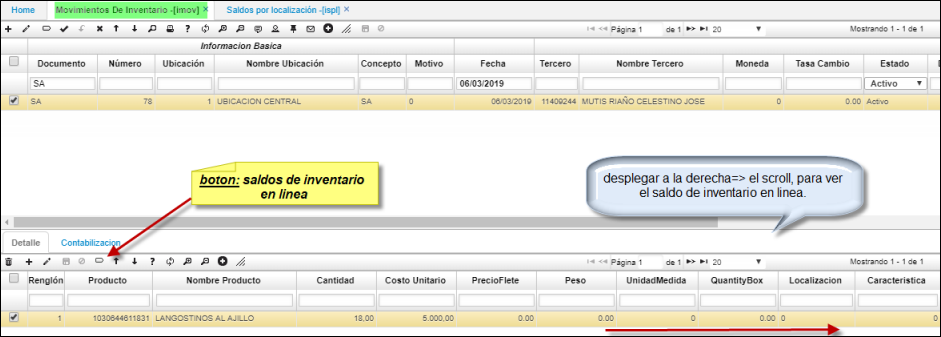

## [Pestaña Contabilización Resumida](http://docs.oasiscom.com/Operacion/scm/inventarios/imovimient/imov#pestaña-contabilización-resumida)

Se crea la pestaña “contabilización resumida” donde se **totalizan** los valores de las cuentas parametrizadas.  

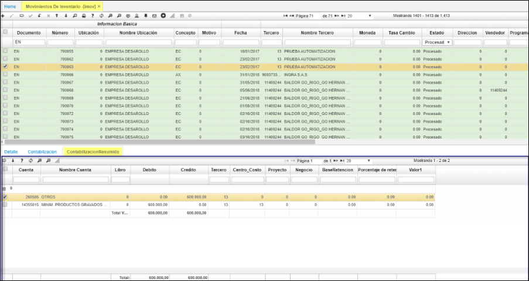

Detalle del **IMOV**.  

* Escenario dos: su saldo en línea permite realizar la transacción, se mostrará en el campo QuantityInventory -1  indicando que existen saldos en línea para este producto.  

## [Vista Previa](http://docs.oasiscom.com/Operacion/scm/inventarios/imovimient/imov#vista-previa)

La funcionalidad de _Vista Previa_ muestra los movimientos de inventario despachado, relacionando la información diligenciada en la aplicación.  

Para acceder a la vista previa, seleccionamos un registro del maestro de la aplicación y damos clic en el botón _Presentación preliminar_  ubicado en la barra de herramientas.  

En seguida, se podrá ver el documento del movimiento de inventario seleccionado.  

El documento podrá ser exportado en formato de Excel, PDF o Word.  

Al exportarlo en formato PDF.  

La información de la sección de _Talla_: cantidad, código antiguo, talla y color, el sistema la toma de los registros de la aplicación [**BPRO - Productos**](http://docs.oasiscom.com/Operacion/common/bprodu/bpro).  

## [**Creación Entradas y Salidas de inventario**](http://docs.oasiscom.com/Operacion/scm/inventarios/imovimient/imov#creación-entradas-y-salidas-de-inventario)

### [**Entradas de Inventario**](http://docs.oasiscom.com/Operacion/scm/inventarios/imovimient/imov#entradas-de-inventario)

Ingresamos a la aplicación **IMOV** crear un nuevo registro **+**. 

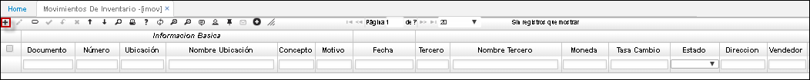

En este caso se realiza una entrada a inventarios 

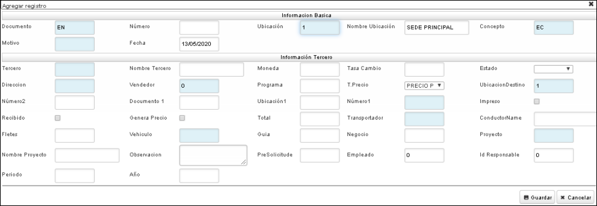

* **Documento:** En este caso, se escoge la opción *EN* que hace referencia a Entradas de Inventario.

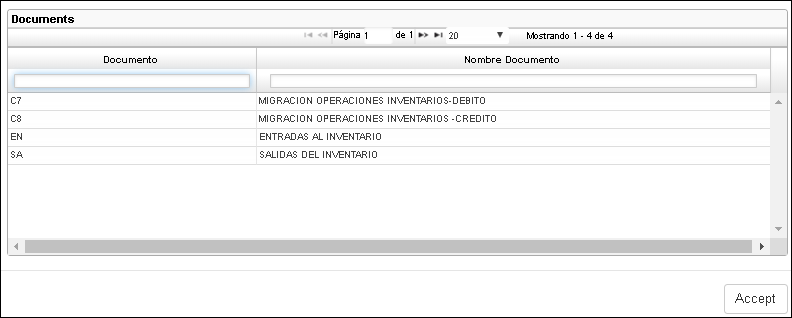

* **Ubicación:** Número de ubicación de la empresa en donde se encuentra el producto, esto se parametriza previamente en la aplicación **BUBI**.   

* **Concepto:** Este debe ser igual al documento, en este caso *EN*.  

* **Tercero:** Seleccionar tercero correspondiente. 

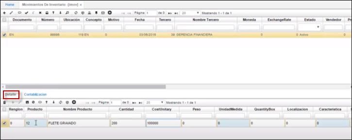

Para realizar el detalle, se adiciona un nuevo registro, en el campo producto, se selecciona el producto del cual se requiere realizar la entrada al inventario, ya sea con el ZOOM o diligenciando el consecutivo del producto. La cantidad del producto y costo unitario es el valor por unidad del producto seleccionado,  se guarda el detalle.  

Antes de procesar el registro se debe ingresar a la aplicación **ICKU** para verificar entradas de ese producto en el inventario. 

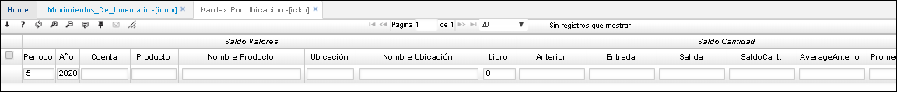

Para realizar esta verificación, se debe filtrar el producto en este campo, con el consecutivo y la ubicación que se diligenció en el registro. 

Filtrando el registro, nos dirigimos al campo entradas, para este caso, este producto tiene 200 entradas a inventario. En el detalle se puede evidenciar los movimientos de inventario realizados con este producto como especificaciones como el tercero, la fecha de movimiento, cantidades y también el documento, para verificar si es una entrada o una salida. 

Luego de verificar el producto en esta aplicación, en la aplicación **IMOV** se procesa  el movimiento.

Al momento de procesar el documento, automáticamente se ve afectado el campo entradas en la aplicación **ICKU**. 

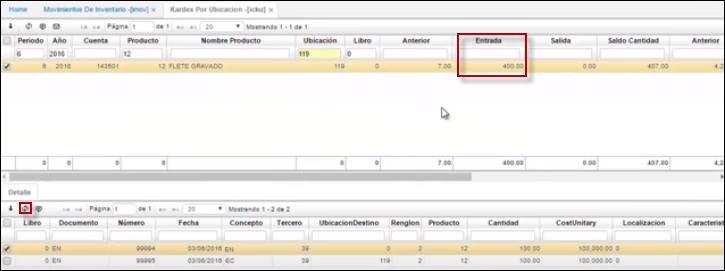

### [**Salidas de Inventario**](http://docs.oasiscom.com/Operacion/scm/inventarios/imovimient/imov#salidas-de-inventario)  

Ingresamos a la aplicación **IMOV** crear un nuevo registro **+**. 

En este caso se realiza una salida a inventarios  

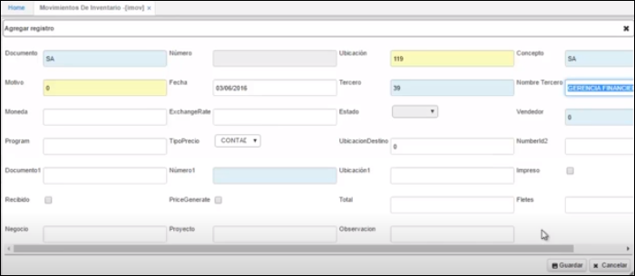

* **Documento:** En este caso se escoge la opción *SA* que hace referencia a Salida de Inventario.

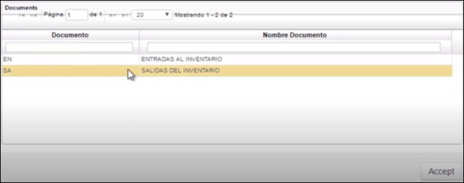

* **Ubicación:** Número de ubicación de la empresa en donde se encuentra el producto, esto se parametriza previamente en la aplicación **BUBI**.   
* **Concepto:** Este debe ser igual al documento, en este caso *SA*.  
* **Tercero:** Seleccionar tercero correspondiente. 

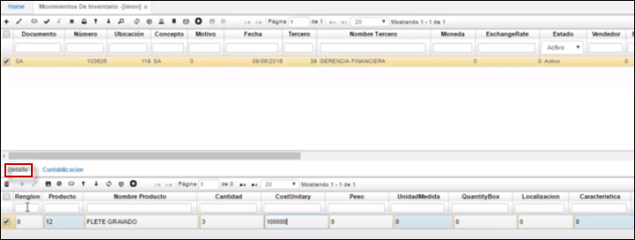

Para realizar el detalle, se adiciona un nuevo registro, en el campo producto, se selecciona el producto el cual se requiere realizar la salida de inventario, ya sea con el ZOOM o diligenciando el consecutivo del producto. La cantidad del producto y costo unitario es el valor por unidad del producto seleccionado,  se guarda el detalle.  

Antes de procesar el registro se debe ingresar a la aplicación **ICKU** para verificar salidas de ese producto en el inventario. 

Para realizar esta verificación, se debe filtrar el producto en este campo, con el consecutivo y la ubicación que se diligenció en el registro. 

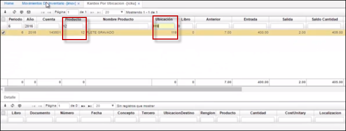

Filtrando el registro nos dirigimos al campo entradas, para este caso este producto tiene 2 salidas a inventario. En el detalle se pueden evidenciar los movimientos de inventario realizados con este producto con especificaciones como el tercero, la fecha de movimiento, cantidades y también el documento, para verificar si es una entrada o una salida. 

Luego de verificar el producto en esta aplicación, en la aplicación **IMOV** se procesa  el movimiento.

Al momento de procesar el documento, automáticamente se ve afectado el campo salida en la aplicación **ICKU**. 

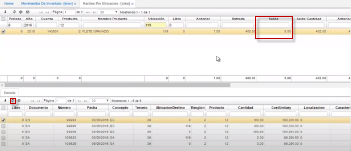

## [Producción](http://docs.oasiscom.com/Operacion/scm/inventarios/imovimient/imov#producción)

Una vez validada la información del pedido, se procesa el documento y se realiza un traslado de los insumos a la bodega requerida, para realizar este movimiento se debe ingresar a la aplicación _IMOV – movimientos de inventarios_.  

**Documento:** SA correspondiente a salida de inventario.  
**Ubicación:** 3 correspondiente a la ubicación de donde saldrá la mercancía.  
**Concepto:** TR correspondiente a traslado.  
**Tercero:** Tercero correspondiente.  
**Ubicación Destino:** 1 La ubicación a la que se requiere llevar la mercancía.  
**Documento1:** LD Documento del pedido creado automáticamente en **LPED**.  
**Número1:** 2 Número del pedido correspondiente al campo anterior.  
**Ubicación1:** 1 Ubicación del pedido correspondiente al campo anterior.  

Cabe resaltar que, si al momento de realizar este registro no recordamos el número del pedido, en el campo número 1 se puede realizar doble clic y el sistema abre una ventana emergente con los pedidos relacionados a ese tercero y en esa respectiva ubicación:  

Se da clic en el botón aceptar y el sistema nos arroja el 2 en el campo número1.  

Al guardar el registro el sistema nos arroja automáticamente el detalle de acuerdo al pedido generado anteriormente, cabe resaltar que para que el sistema realice esto es necesario diligenciar los campos de color naranja de la imagen anterior para identificar a qué pedido está asociado.  

Se procesa el registro   

## [Inventario Periódico e Inventario Cíclico](http://docs.oasiscom.com/Operacion/scm/inventarios/imovimient/imov#inventario-periódico-e-inventario-cíclico)

En la aplicación **IMOV** se validarán los documentos de ajuste generados por la aplicación [**IFAJ - Genera Ajustes**](http://docs.oasiscom.com/Operacion/scm/inventarios/ifisico/ifaj), estos deberán ser procesados con el fin de adecuar correctamente el inventario realizado.  

Estos documentos se pueden procesar con el fin de adecuar el inventario realizado. Para consultar los documentos filtraremos por la fecha en que se realizó el inventario.  

En la aplicación se generó un documento _EN - Entradas al inventario_ por concepto _EA - Entrada por ajuste_, el cual corresponde a las unidades que se encuentran físicamente pero que no estaban registradas en el sistema. Por otro lado, también se generó el documento _SA - Salidas del inventario_ por concepto _SA - Salida por ajuste_, el cual corresponde a las unidades de más que se encuentran registradas en el sistema pero que no existen físicamente. En el detalle de cada documento se podrán ver los productos a los cuales se les realizó ajuste.  

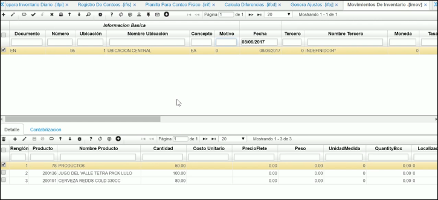

Validada la información, procesamos los documentos dando clic en el botón _Procesar_  ubicado en la barra de herramientas; esto permitirá que el inventario sea ajustado correctamente.  

Para verificar que el inventario haya sido ajustado correctamente ingresaremos a la aplicación [**ISPL - Saldos por Localización**](http://docs.oasiscom.com/Operacion/scm/inventarios/isaldo/ispl#inventario-periódico-e-inventario-cíclico).  

## [Generación de Ajuste al Costo](http://docs.oasiscom.com/Operacion/scm/inventarios/imovimient/imov#generación-de-ajuste-al-costo)

Esta funcionalidad permite generar el ajuste de costo diferencial de la exportación, donde del valor total se debe descontar del valor de la materia prima y ese será el valor a ajustar en inventario.  

El proceso consiste en generar un documento de ajuste en la aplicación **IMOV** desde la opción [**XEXP - Exportaciones**](http://docs.oasiscom.com/Operacion/scm/exportaciones/xexportaciones/xexp) por cada renglón de la exportación. El valor del ajuste se hará con el valor diferencial resultante de la resta del valor total del costo unitario calculado  menos el valor de la materia prima. Ejemplo, si el costo total es de 100 y el valor de la materia prima es de 65, el valor del ajuste será de 35.  

Para identificar el concepto de materia prima en una liquidación de exportación, se colocará en la opción [**BCON - Conceptos**](http://docs.oasiscom.com/Operacion/common/bsistema/bcon) en el concepto elegido, la letra **I** en el campo Módulo.  

Para saber el concepto por el cual se generará el ajuste en el IMOV, se parametrizará en la opción [**BDOC - Documentos**](http://docs.oasiscom.com/Operacion/common/bsistema/bdoc) para el documento **EN** en la pestaña detalle, en el concepto elegido una **X** en el campo Módulo.  

Con el botón _Genera ajuste_ de la opción  [**XEXP - Exportaciones**](http://docs.oasiscom.com/Operacion/scm/exportaciones/xexportaciones/xexp) se podrá crear de forma automática el documento en la aplicación IMOV. Sólo se podrá generar el documento cuando el estado del renglón sea **P**.  

El documento de ajuste siempre se generará en estado _Procesado_.  

## [**Ingreso de mercancía importada**](http://docs.oasiscom.com/Operacion/scm/inventarios/imovimient/imov#ingreso-de-mercancía-importada)

Cuando se realiza una importación es necesario crear una entrada de la mercancía a inventarios, esto se realiza en la aplicación _IMOV - Movimientos Inventarios_ de OasisCom. _Este proceso se recomienda hacer después de nacionalizada la mercancía._  

En la aplicación IMOV creamos un nuevo registro con documento **EN - Entradas al inventario** y concepto **EI - Entrada por importación**.  

La entrada de inventarios se ingresa con moneda 0 correspondiente a pesos. Se debe asociar el documento **IM** de la importación creado previamente en la aplicación [**YIMP - Importaciones**](http://docs.oasiscom.com/Operacion/scm/importacion/yimportaci/yimp#proceso-de-importaciones).  

Diligenciado el formulario damos clic en el botón _Guardar_. El sistema al guardar el maestro arrojará automáticamente el detalle de la importación con los costos por producto en pesos colombianos.  

Finalmente, procesamos el documento **EN** y verificamos la pestaña del detalle **Contabilización**.  

_Conoce el proceso completo de importaciones [**Aquí**](http://docs.oasiscom.com/Operacion/scm/importacion/yimportaci/yimp#proceso-de-importaciones)_.  

## [**Salida de inventario por una orden de compra**](http://docs.oasiscom.com/Operacion/scm/inventarios/imovimient/imov#salida-de-inventario-por-una-orden-de-compra)

Una vez creada la orden de servicio y los productos correspondientes, se debe realizar la salida de inventario de los productos necesarios para realizar el mantenimiento al equipo. Esto se realiza a través de la opción **IMOV – Movimientos de Inventario**.  

[**Salida de inventario en IMOV**](http://docs.oasiscom.com/Operacion/scm/inventarios/imovimient/imov)

Creamos un nuevo registro en la aplicación IMOV y diligenciamos el formulario:  

**Documento:** para esta opción se trabajará con el documento _SA_ que corresponde a una Salida de Inventario.  

**Ubicación:** se debe seleccionar ya sea desde el zoom o ingresarlo manualmente, la ubicación en donde se está separando el producto necesario para efectuar la orden de servicio.  

**Concepto:** se debe seleccionar el concepto por el cual se facturará la orden, en este caso es _OT – Cargo a Tercero_ dado que la factura será cargada al cliente propietario del equipo al cual se le realiza el mantenimiento.  

> **Nota:** Se debe considerar que, de acuerdo al concepto elegido, deben estar parametrizados de la siguiente manera en la opción [**BDOC - Documentos**](http://docs.oasiscom.com/Operacion/common/bsistema/bdoc):

 * Si se eligió **OT** en el campo concepto, en el campo _Clase_ del detalle de esta opción, debe estar seleccionada la opción _Cargo a tercero_:  

 * Si se eligió el concepto **GT**, en el campo _Clase_ del detalle de esta opción, debe estar seleccionada la opción _Garantía_:  

 _**Fin de la nota.**_

**Tercero:** se debe ingresar el número de identificación del tercero al cual se le va a cargar la factura correspondiente.  

**Nombre Tercero:** se llena de manera automática una vez ingresado el número de identificación del tercero.  

**Documento 1, Número 1** y **Ubicación 1:** se deben diligenciar de acuerdo con lo llenado en el registro de la opción **MORD**, de esta manera deberá ponerse _OT_, _2_ y _1_ respectivamente.  

Posteriormente se guarda el registro.  

Nótese como el registro del detalle se llena de manera automática mostrando el producto que fue ingresado en la opción **MORD** para realizar la salida de inventario correspondiente.  

Posteriormente, se procesa el documento de salida de inventario en IMOV.  

Conoce el proceso completo de WorkFlow Task [**Aquí**](http://docs.oasiscom.com/Operacion/mrp/mantenimiento/morden/mord#workflow-task).  

