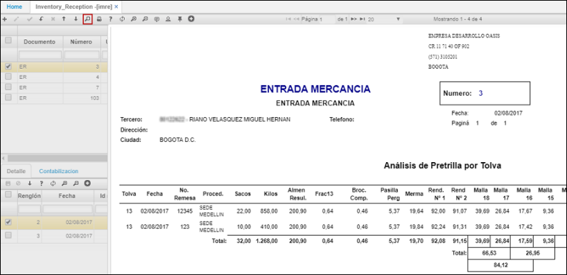
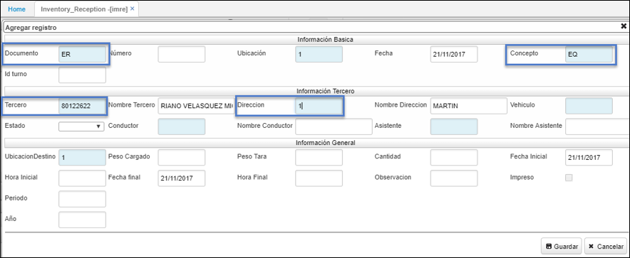
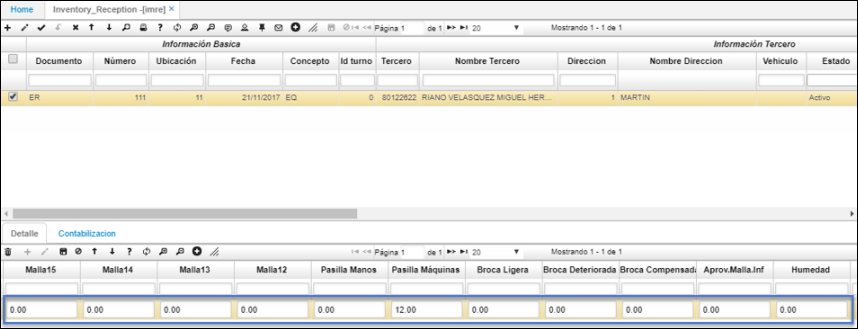
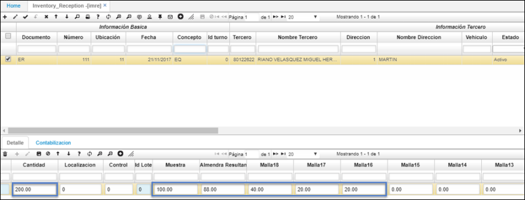
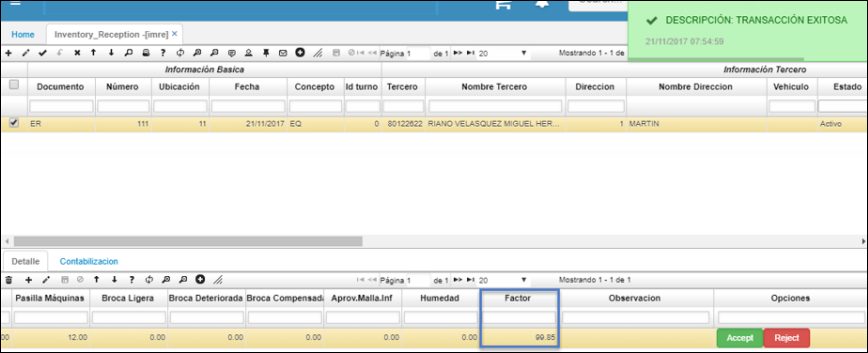
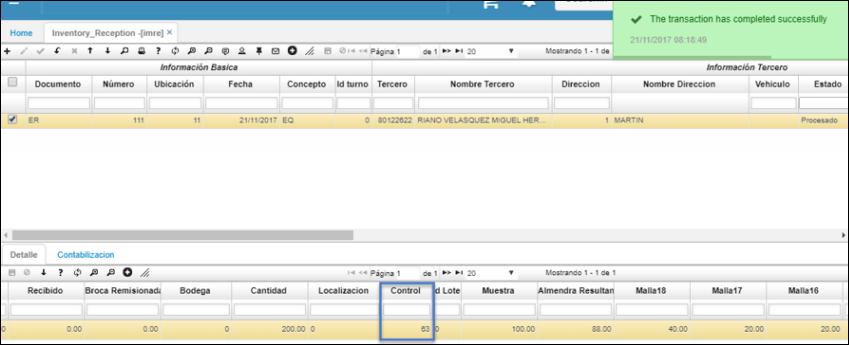
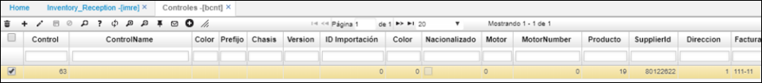

# IMRE - Recepción de Mercancía

La aplicación IMRE permite registrar la mercancía que se recepciona, tanto quien la transporta como las remisiones que contenga el viaje.  

En el maestro de la aplicación se creará un nuevo registro y se diligenciarán los siguientes campos:  

**Documento:** ingresar documento ER correspondiente a Entrada de Mercancía. Los documentos son parametrizables en la aplicación [**BDOC - Documentos**](http://docs.oasiscom.com/Operacion/common/bsistema/bdoc).  
**Número:** el sistema asignará un número de consecutivo automáticamente cuando se guarde el registro.  
**Ubicación:** seleccionar la ubicación que recepciona la mercancía.  
**Concepto:** ingresar el concepto ER. Los conceptos son parametrizables en la aplicación [**BCON - Conceptos**](http://docs.oasiscom.com/Operacion/common/bsistema/bcon).  
**Tercero:** ingresar el número de identificación del usuario que recepciona la mercancía o seleccionarlo del zoom.  
**Vehículo:** seleccionar del zoom el vehículo que transporta la mercancía.  
**Conductor:** ingresar el número de identificación del conductor del vehículo o seleccionarlo del zoom.  
**Peso Cargado:** peso de la carga de mercancía.  

Ingresados los datos, damos click en el botón _Guardar_.  

Seguidamente nos dirigimos al detalle, en donde se especificará la distribución de la mercancía recibida.  

Se agrega un nuevo renglón, se ingresan los datos correspondientes a la carga que tiene remisión y se guardan los cambios dando click en el botón . Este proceso se realizará con cada remisión que tenga la mercancía recibida.  

Ingresada la información anterior, se debe procesar el documento dando click en el botón _Procesar_  ubicado en la barra de herramientas del maestro.  

Al procesar, el sistema arrojará un mensaje de control indicando que el documento fue procesado satisfactoriamente.  

La aplicación **IMRE** cuenta con una vista previa que permite la visualizacion de la facturación por vehículo día a día.  

Para acceder a ella damos click en el botón  ubicado en la barra de herramientas del maestro.  

## [**Creación y recepción de micro lotes**](http://docs.oasiscom.com/Operacion/scm/inventarios/imovimient/imre#creación-y-recepción-de-micro-lotes)

En la opción **IMRE** se realiza el proceso de recepción de muestras (micro lotes), así:  

En el maestro, se debe utilizar el documento ER (Entrada Mercancía) por concepto EQ (Entrada Micro lotes) y se deben digitar datos primordiales como el tercero y la finca (dirección) a la cual pertenece la muestra:  

En el detalle, se deben registrar los datos de calidad pertinentes de la muestra en los campos resaltados en las siguientes imágenes:  

Al guardar el registro del detalle, el sistema traerá el factor de rendimiento de acuerdo a los datos de calidad ingresados. Este cálculo, se evidencia en el campo _Factor_ de este mismo detalle.  

Al confirmar el registro, automáticamente creará un control (campo _Control_ del detalle), que a su vez será un identificador único de la muestra y alimentará al módulo de inventarios. Estos controles pueden ser visualizados en la opción **BCNT - Controles**, que en este caso corresponde al control No. 63. El documento CL en el [**BCNS - Consecutivos**](http://docs.oasiscom.com/Operacion/common/bsistema/bcns) será el encargado de controlar los consecutivos de los controles.  

En la opción **BCNT - Controles**:  

