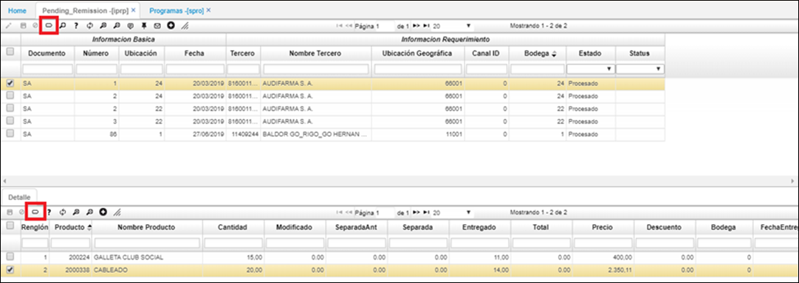

# IPRP - Remisiones Pendientes.  

Se crea opcion tipo B, donde se listan las remisiones pendientes posee la funcionalidad de terminarlas a nivel general o por item registrado en la remision. 
En esta aplicación permite dar por terminada a nivl general o por items las remisiones pendientes.  
La aplicación tiene configurado los botones tanto en el maestro como en el detalle.  
Estos botones serviran para dar por terminado la remision pendiente seleccionada.  

