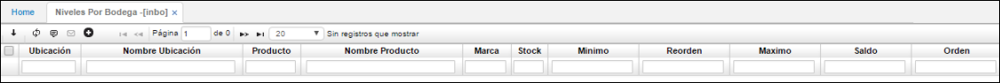

# Niveles por Bodega - INBO

Aplicación que permite la consulta de los niveles de stock calculados en cada una de las bodegas y en los cuales se puede notar el nivel actual con respecto a estos niveles, para observar si hay faltante, sobrante, nivel crítico, etc. Así mimo muestra el consumo promedio, el lote económico, los días de pedido.  

También se puede observar la cantidad pendiente por despachar (reservada o comprometida) y la pendiente por recibir (por compras o producción).  

