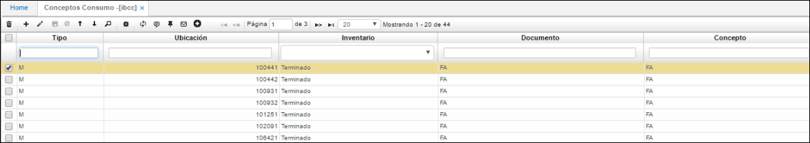
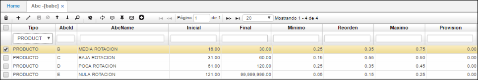
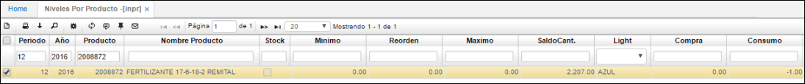
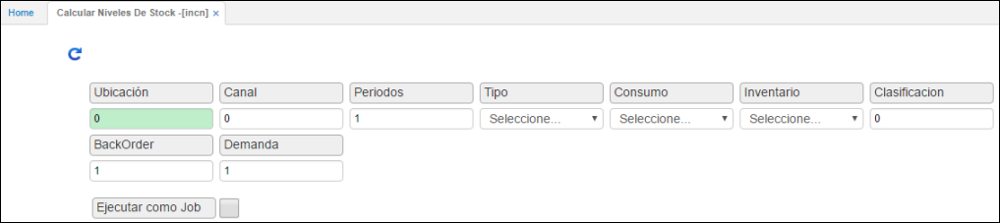
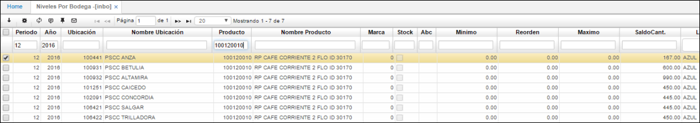

# Calcular Niveles de Stock - INCN

NIVELES DE STOCK  
PASOS A SEGUIR  
**1.	PARAMETRIZACIÓN**   
Los niveles de stock y el cálculo de los mismos permiten a la empresa saber como se comporta la mercancía, los niveles de rotación y consumo para tener unas políticas más eficientes en la labor de ventas, por ejemplo, saber con certeza como mover mercancía entre diferentes ubicaciones. El cálculo de niveles de stock puede realizarse a nivel de empresa o por ubicaciones (bodegas).   
**1.1	Conceptos de Consumo [IBCC]**  
El primer pasó para iniciar el proceso de niveles de stock en **OASIS** es parametrizar los conceptos de consumo, esto se realiza en la aplicación **[IBCC]**.    
Esta aplicación se encuentra dentro del módulo de **LOGÍSTICA SCM** Inventarios dentro de la carpeta de **DATOS BÁSICOS.**   
Los conceptos de consumo son definidos por la empresa aunque en una gran mayoría de los casos el consumo simplemente es **TODO LO QUE SE VENDE MENOS TODO LO QUE ES DEVUELTO A LA COMPAÑÍA.**   
**Generalmente las compañías consideran como consumo los traslados entre bodegas, este error es muy frecuente, sin embargo, no es consumo pues la mercancía nunca sale de la empresa como tal.**   

**IBCC**

En la aplicación de Conceptos de Consumo **[IBCC]** encontrará 5 columnas:  
**•	Tipo:** “M” material.  
**•	Ubicación:** Los conceptos de consumo deben ser parametrizados para todas y cada una de las ubicaciones que la empresa haya definido como bodegas en el Básico de Bodegas **[BUBI]**.   
**•	Inventario:** Aquí se define para que tipo de inventarios se van a definir los conceptos de consumo. Sean productos terminados, suministros o materia prima.   
**•	Documento:** Es una parte fundamental de la parametrización pues se deben definir todos los documentos y conceptos que afectan consumo para cada una de las ubicaciones.   
**•	Concepto:**Se deben señalar todos los conceptos que afectan el consumo por cada documento que se especifique.   
Recuerde:   
La parametrización de los conceptos de consumo debe hacerse para todas y cada una de las ubicaciones (bodegas) de la empresa que se consideren como bodegas incluyendo todos los documentos y conceptos que afecten el consumo en cada una de las ubicaciones.   

**1.2  	Clasificación ABC  [BABC]**  
Para una compañía es vital mantener información veraz y actualizada sobre el comportamiento de sus productos, la rotación y éxito en el mercado de estos, por ello cuando se manejan niveles de stock se utiliza la clasificación ABC, que separa los productos de acuerdo a sus niveles de rotación, alta, media, baja, muy baja, etc., todo depende la política que quiera manejar la empresa.   
OASISCOM de acuerdo a los días de rotación de los productos calcula la clasificación ABC para cada producto, en el momento de la implementación se le pedirá a Usted como cliente de acuerdos a sus comportamientos históricos de demanda calificar cada producto de acuerdo a sus políticas de rotación de inventarios.    
La clasificación ABC se parametriza en la aplicación ABC **[BABC],** esta se encuentra en el módulo de **COMUNES >> PRODUCTOS >>.**  
Para que **OASISCOM** realice el control de stock para cada producto se debe encender el checkbox de Stock para cada producto en el básico de **productos [BPRO]** en la pestaña inventarios.   

**BABC**  

  

•	**Tipo:**Para el caso del control de niveles de stock se debe colocar producto.   
•	**Código:** Como se menciono antes cada empresa define sus clasificaciones ABC, para las rotaciones de inventario, en este caso se parametrizan los diferentes niveles que defina la empresa.   
•	**Nombre:** El nombre otorgado a cada clasificación de rotación de inventarios, por ejemplo, alta rotación, baja rotación, etc.   
•	**Inicial y Final:** En estos dos campos se definen los rangos de productos, en cantidades, para cada segmento de rotación **ABC.**   
•	**Mínimo, Reorden y Máximo:** Estos tres campos indicaran el factor a multiplicar el valor de consumo por mes de un producto según su clasificación, un ejemplo seria que si el consumo es de 25 unidades al mes el factor del nivel mínimo es de 1.5 el sistema asignara como nivel minino en la aplicación **INPR o INBO** según el caso un valor de 37.5 que sale de multiplicar el consumo por el factor (25 * 1.5), del mismo modo aplica para reorden y máximo.    

**2.	 NIVELES DE STOCK   [INCN]**
Para realizar el cálculo de **niveles de stock OASISCOM** toma periodos hacia atrás a partir del mes anterior en el que se realiza el cálculo. Se sugiere que la empresa lleve datos históricos de consumo en OASISCOM de por lo menos tres meses.   
El cálculo siempre se realiza periódico, para cada tipo de producto, terminado, materia prima o suministro. 
En **OASISCOM** tras haber finalizado la parametrización con la definición de ABC entramos a calcular los niveles de stock, una aplicación fundamental es la de niveles por producto **[INPR]**, en esta aplicación se encuentra en el módulo de LOGÍSTICA SCM, en el subnivel de inventarios, la carpeta de Niveles de Stock.   

Para cada producto que tenga control de stock en **OASISCOM** la aplicación Niveles por Producto **[INPR]** va a generar un control tipo semáforo, que indica el estado actual de inventarios de este producto, de acuerdo a la parametrización dada en la aplicación de ABC **[BABC]**, a los campos mínimo, reorden y máximo, este control de semáforos esta dado por:   
•	**Semáforo Rojo:** Indica que el stock del producto se encuentra por debajo de su nivel mínimo.   
**o	Formula: saldo < Nivel mínimo.**   

**•	Semáforo Amarillo:** El nivel de stock se encuentra entre el nivel mínimo y el punto de reorden.    
**o	Formula: saldo >= nivel mínimo y saldo < nivel reorden.**  

**•	Semáforo Verde:** Los niveles de stock del producto están entre el punto de reorden y el nivel máximo.   
**o	Formula: saldo > reorden y saldo <= nivel máximo**.  

**•	Semáforo Azul:** Los niveles de stock están por encima del nivel máximo definido.   
**o	Formula: saldo > nivel máximo**.   

**Fórmula para calcular los días de rotación:**   

Número de veces = Suma del consumo de los periodos tenidos en cuenta/ ((saldo inicial del primer mes que se tiene en cuenta + saldo del último mes que se tiene en cuenta) / 2)  
Días rotación = (Numero de periodos tomados en cuenta * 30) / Número de veces.  

**Recuerde:**   
Todos los datos de esta aplicación provienen del cálculo de niveles de stock **[INCN]**, aplicación que veremos a continuación.   

**2.1	CALCULO DE NIVELES DE STOCK **  
Para ejecutar este cálculo, utilizamos la aplicación Cálculo de Niveles de Stock **[INCN]**, esta aplicación se encuentra en el módulo de LOGÍSTICA SCM, el subnivel de inventarios, y la carpeta de Niveles de Stock.   

   

En esta aplicación definimos los parámetros para el cálculo de niveles de stock, antes de ejecutar este proceso desde esta misma aplicación, los campos a definir son:   
**•	Ubicación:** Se define para que ubicación especifica se va a realizar el cálculo de niveles de stock, si se quiere realizar para todas las ubicaciones se debe colocar CERO (0).   
**•	Canal:** Si la compañía maneja canales como franquicias, mayoristas, detallistas, etc., y desea calcular los niveles de stock para uno en especial debe colocar el numero de este, en caso contrario se deja el CERO (0).  
**•	Periodos:** En este campo se definen los meses hacia atrás del periodo actual para los que se desea calcular los niveles de stock.   
**•	Tipo:** En este campo desplegable, se tiene la opción de elegir para que tipo de opción se va a realizar el cálculo de los niveles de stock, bien sea para los productos en su totalidad, o para una ubicación específica.   
**•	Consumo:** Se determina que el cálculo de niveles de stock va a ser periódico.   
**•	Inventarios:** En este campo elegimos para que tipo de inventario por producto deseamos realizar el cálculo, producto terminado, suministros o materia prima.   
**•	Clasificación:** Dependiendo si la compañía posee una estructura definida de clasificaciones de productos es posible ejecutar el cálculo de niveles de stock para una de ellas, consulte la posibilidad de esta opción con el equipo de implementación o soporte de OASISCOM R3.   
**•	ABC:** En este campo se define para que tipo de productos de acuerdo a su clasificación ABC se desea calcular los niveles de stock, si desea correr el proceso para todos los productos se debe colocar N o si no las diferentes clasificaciones A (alta rotación) B (media rotación), etc.   
**•	Periodos BackOrder:** Se colocan los mismos periodos de cálculo que en el campo anterior denominado PERIODOS.   
**•	 Periodos por Demanda:** Se colocan los mismos periodos de cálculo que en el campo anterior denominado **PERIODOS.  
LUEGO DE DEFINIR TODOS LOS CAMPOS PRESIONAMOS EL BOTÓN ACEPTAR PARA EJECUTAR EL CÁLCULO DE NIVELES DE STOCK.**   

**3.	CONSULTAS**   
**3.1	Niveles por Bodega** **[INBO]**   
Esta consulta de los cálculos efectuados por el proceso de cálculos de niveles de stock se encuentra en el módulo de LOGÍSTICA SCM, el subnivel de inventarios, la carpeta de niveles de stock.   

  

La aplicación de Niveles por Bodega **[INBO]** muestra los niveles de stock de cada producto teniendo en cuenta las bodegas, esta surge cuando se realiza el cálculo de niveles de stock por ubicaciones.   

**3.2	Saldo Periódico por Producto [ISSP]**   
Esta opción le permite consultar los consumos históricos de la compañía en un periodo de tiempo determinado a nivel de toda la empresa.   

**3.3	Saldos Periódicos por Bodega [ISPB]**  
Similar a la consulta de saldos periódicos por producto esta aplicación le indica los consumos históricos definidos por cada bodega de la compañía. Al igual que el **[ISPP]** se encuentra dentro del **MÓDULO de LOGÍSTICA SCM,** el subnivel de inventarios, y la carpeta de saldos.   

**3.4	Reportes:**
Rotación de inventarios:  **IRRO; IRRI.**  
Niveles de Stock: **IRNV; IRNI**   

