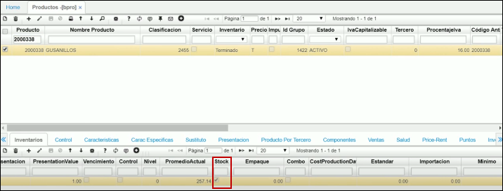
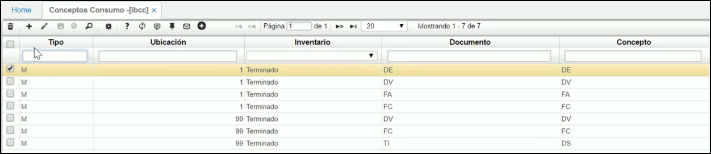
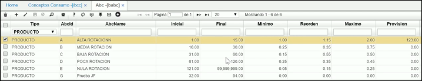
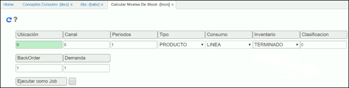
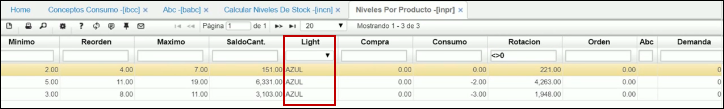

# Calcular Niveles de Stock - INCN  

* [**Parametrización**](http://docs.oasiscom.com/Operacion/scm/inventarios/inivel/incn#parametrización) 
>* [**Conceptos de Consumo IBCC**](http://docs.oasiscom.com/Operacion/scm/inventarios/inivel/incn#conceptos-de-consumo-ibcc)
>* [**Clasificación ABC - BABC**](http://docs.oasiscom.com/Operacion/scm/inventarios/inivel/incn#clasificación-abc---babc)

* [**Niveles de Stock INCN**](http://docs.oasiscom.com/Operacion/scm/inventarios/inivel/incn#niveles-de-stock-incn)
>* [**Calculo de Niveles de Stock**](http://docs.oasiscom.com/Operacion/scm/inventarios/inivel/incn#calculo-de-niveles-de-stock)

* [**Consultas**](http://docs.oasiscom.com/Operacion/scm/inventarios/inivel/incn#consultas)
>* [**Niveles por Bodega INBO**](http://docs.oasiscom.com/Operacion/scm/inventarios/inivel/incn#niveles-por-bodega-inbo)
>* [**Saldo Periódico por Producto ISSP**](http://docs.oasiscom.com/Operacion/scm/inventarios/inivel/incn#saldo-periódico-por-producto-issp)
>* [**Saldos Periódicos por Bodega ISPB**](http://docs.oasiscom.com/Operacion/scm/inventarios/inivel/incn#saldos-periódicos-por-bodega-ispb)
>* [**Reportes**](http://docs.oasiscom.com/Operacion/scm/inventarios/inivel/incn#reportes)

## [**Parametrización**](http://docs.oasiscom.com/Operacion/scm/inventarios/inivel/incn#parametrización)   

Los niveles de stock y el cálculo de los mismos permiten a la empresa saber cómo se comporta la mercancía, los niveles de rotación y consumo para tener unas políticas más eficientes en la labor de ventas, por ejemplo, saber con certeza como mover mercancía entre diferentes ubicaciones. El cálculo de niveles de stock puede realizarse a nivel de empresa o por ubicaciones (bodegas).   

Antes de iniciar el proceso, es importante tener en cuenta que los productos deben estar con el flags del campo stock activo en la aplicación **BPRO**, para que el sistema los identifique al momento de realizar el proceso. 

### [**Conceptos de Consumo IBCC**](http://docs.oasiscom.com/Operacion/scm/inventarios/inivel/incn#conceptos-de-consumo-ibcc)

El primer paso para iniciar el proceso de niveles de stock, allí parametrizamos los conceptos de consumo, los cuales son definidos por la empresa. Este proceso se realiza en la aplicación **IBCC**.  

Los conceptos de consumo generalmente es todo lo que se vende en la compañía. Los traslados y devoluciones NO son objetos de consumo puesto que los productos nunca salen  de la empresa, es decir todo lo que se vende.  
Generalmente las compañías consideran como consumo los traslados entre bodegas, este error es muy frecuente, sin embargo, no es consumo pues la mercancía nunca sale de la empresa.  

En esta aplicación encontraras 5 columnas como:

+ **Tipo:** “M” material.  
+ **Ubicación:** Los conceptos de consumo deben ser parametrizados para todas y cada una de las ubicaciones que la empresa haya definido como bodegas en el Básico de Bodegas **BUBI**. 
+ **Inventario:** Aquí se define para que tipo de inventarios se van a definir los conceptos de consumo. Sean productos terminados, suministros o materia prima.   
+ **Documento:** Es una parte fundamental de la parametrización pues se deben definir todos los documentos y conceptos que afectan consumo para cada una de las ubicaciones.   
+ **Concepto:**Se deben señalar todos los conceptos que afectan el consumo por cada documento que se especifique.   

**Recuerde:** La parametrización de los conceptos de consumo debe hacerse para todas y cada una de las ubicaciones (bodegas) de la empresa que se consideren como bodegas incluyendo todos los documentos y conceptos que afecten el consumo en cada una de las ubicaciones.   

### [**Clasificación ABC - BABC**](http://docs.oasiscom.com/Operacion/scm/inventarios/inivel/incn#clasificación-abc---babc)

Para una compañía es vital mantener información veraz y actualizada sobre el comportamiento de sus productos, la rotación y éxito en el mercado de estos, por ello cuando se manejan niveles de stock se utiliza la clasificación ABC, que separa los productos de acuerdo a sus niveles de rotación, alta, media, baja, muy baja, etc., todo depende la política que quiera manejar la empresa.   

De acuerdo a los días de rotación de los productos se calcula la clasificación ABC para cada producto, en el momento de la implementación se le pedirá a Usted como cliente de acuerdos a sus comportamientos históricos de demanda calificar cada producto de acuerdo a sus políticas de rotación de inventarios.   

En la aplicación **BABC,** se parametriza el nivel de rotación de un producto.

  

* **Tipo:**Para el caso del control de niveles de stock se debe colocar producto.  
* **Código:** Como se mencionó antes cada empresa define sus clasificaciones ABC, para las rotaciones de inventario, en este caso se parametrizan los diferentes niveles que defina la empresa.   
* **Nombre:** El nombre otorgado a cada clasificación de rotación de inventarios, por ejemplo, alta rotación, baja rotación, etc.   
* **Inicial y Final:** En estos dos campos se determina en días el tipo de rotación en el inventario. El sistema valida las salidas de un producto durante un mes y de acuerdo a esto lo clasifican en un tipo de rotación.  
* **Mínimo, Reorden y Máximo:** Estos tres campos indicaran el factor a multiplicar el valor de consumo por mes de un producto según su clasificación, un ejemplo seria que si el consumo es de 25 unidades al mes el factor del nivel mínimo es de 1.5 el sistema asignara como nivel minino en la aplicación **INPR o INBO** según el caso un valor de 37.5 que sale de multiplicar el consumo por el factor (25 * 1.5), del mismo modo aplica para reorden y máximo.   

## [**Niveles de Stock INCN**](http://docs.oasiscom.com/Operacion/scm/inventarios/inivel/incn#niveles-de-stock-incn)

### [**Calculo de Niveles de Stock**](http://docs.oasiscom.com/Operacion/scm/inventarios/inivel/incn#calculo-de-niveles-de-stock)

Para realizar el cálculo de niveles de stock, el sistema toma periodos hacia atrás a partir del mes anterior en el que se realiza el cálculo. Se sugiere que la empresa lleve datos históricos de consumo por lo menos de tres meses.   

El cálculo siempre se realiza periódico, para cada tipo de producto, terminado, materia prima o suministro. 

  

En esta aplicación vamos a calcular los niveles de stock
* **Ubicación:** donde se especifica para que ubicación se va a realizar el cálculo. 
* **Periodo:** allí se diligencia la cantidad de meses atrás para los que se desee calcular los niveles de stock. 
* **Tipo:** Se encuentra una lista desplegable y se puede seleccionar si se requiere que el cálculo se realice para todos los productos o para una ubicación específica, en este caso seleccionamos productos. 
* **Inventaros:** Seleccionamos terminado. 

Realizamos nuestro cálculo dando clic.   

Ahora vamos a validar la información, ingresamos a la aplicación **INPR** de niveles por producto esta aplicación generara un control tipo semáforo el cual indicara el estado actual de los productos en inventarios. 

En el campo light encontramos el control tipo semáforo.  

* **Semáforo Rojo:** Indica que el stock del producto se encuentra por debajo de su nivel mínimo.   
> Formula: saldo < Nivel mínimo.  

* **Semáforo Amarillo:** El nivel de stock se encuentra entre el nivel mínimo y el punto de reorden.  
> Formula: saldo >= nivel mínimo y saldo < nivel reorden.  

* **Semáforo Verde:** Los niveles de stock del producto están entre el punto de reorden y el nivel máximo.   
> Formula: saldo > reorden y saldo <= nivel máximo.  

* **Semáforo Azul:** Los niveles de stock están por encima del nivel máximo definido.   
> Formula: saldo > nivel máximo.   

**Fórmula para calcular los días de rotación:**   

Número de veces = Suma del consumo de los periodos tenidos en cuenta/ ((saldo inicial del primer mes que se tiene en cuenta + saldo del último mes que se tiene en cuenta) / 2)  
Días rotación = (Numero de periodos tomados en cuenta * 30) / Número de veces.  

## [**Consultas**](http://docs.oasiscom.com/Operacion/scm/inventarios/inivel/incn#consultas)

### [**Niveles por Bodega INBO**](http://docs.oasiscom.com/Operacion/scm/inventarios/inivel/incn#niveles-por-bodega-inbo) 

Esta consulta de los cálculos efectuados por el proceso de cálculos de niveles de stock se encuentra en el módulo de LOGÍSTICA SCM, el subnivel de inventarios, la carpeta de niveles de stock.   

  

La aplicación de Niveles por Bodega **INBO** muestra los niveles de stock de cada producto teniendo en cuenta las bodegas, esta surge cuando se realiza el cálculo de niveles de stock por ubicaciones.   

### [**Saldo Periódico por Producto ISSP**](http://docs.oasiscom.com/Operacion/scm/inventarios/inivel/incn#saldo-periódico-por-producto-issp)

Esta opción le permite consultar los consumos históricos de la compañía en un periodo de tiempo determinado a nivel de toda la empresa.   

### [**Saldos Periódicos por Bodega ISPB**](http://docs.oasiscom.com/Operacion/scm/inventarios/inivel/incn#saldos-periódicos-por-bodega-ispb)

Similar a la consulta de saldos periódicos por producto esta aplicación le indica los consumos históricos definidos por cada bodega de la compañía. Al igual que el **ISPP** se encuentra dentro del **MÓDULO de LOGÍSTICA SCM,** el subnivel de inventarios, y la carpeta de saldos.   

### [**Reportes**](http://docs.oasiscom.com/Operacion/scm/inventarios/inivel/incn#reportes)

Rotación de inventarios:  **IRRO; IRRI.**  
Niveles de Stock: **IRNV; IRNI.**   

