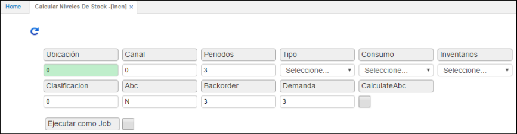

# Calcular Niveles de Stock - INCN

NIVELES DE STOCK  
PASOS A SEGUIR  
**1.	PARAMETRIZACIÓN**   
Los niveles de stock y el cálculo de los mismos permiten a la empresa saber como se comporta la mercancía, los niveles de rotación y consumo para tener unas políticas más eficientes en la labor de ventas, por ejemplo, saber con certeza como mover mercancía entre diferentes ubicaciones. El cálculo de niveles de stock puede realizarse a nivel de empresa o por ubicaciones (bodegas).   
**1.1	Conceptos de Consumo [ibcc]**  
El primer pasó para iniciar el proceso de niveles de stock en OASIS es parametrizar los conceptos de consumo, esto se realiza en la aplicación [ibcc].    
Esta aplicación se encuentra dentro del módulo de LOGÍSTICA SCM >> Inventarios dentro de la carpeta de DATOS BÁSICOS.
Los conceptos de consumo son definidos por la empresa aunque en una gran mayoría de los casos el consumo simplemente es **TODO LO QUE SE VENDE MENOS TODO LO QUE ES DEVUELTO A LA COMPAÑÍA.** 
**Generalmente las compañías consideran como consumo los traslados entre bodegas, este error es muy frecuente, sin embargo, no es consumo pues la mercancía nunca sale de la empresa como tal.**   

**IBCC**

En la aplicación de Conceptos de Consumo [ibcc] encontrará 5 columnas:  
•	Tipo: “M” material.  
•	Ubicación: Los conceptos de consumo deben ser parametrizados para todas y cada una de las ubicaciones que la empresa haya definido como bodegas en el Básico de Bodegas [bubi].   
•	Inventario: Aquí se define para que tipo de inventarios se van a definir los conceptos de consumo. Sean productos terminados, suministros o materia prima.   
•	Documento: Es una parte fundamental de la parametrización pues se deben definir todos los documentos y conceptos que afectan consumo para cada una de las ubicaciones.   
•	Concepto: Se deben señalar todos los conceptos que afectan el consumo por cada documento que se especifique.   
Recuerde:   
La parametrización de los conceptos de consumo debe hacerse para todas y cada una de las ubicaciones (bodegas) de la empresa que se consideren como bodegas incluyendo todos los documentos y conceptos que afecten el consumo en cada una de las ubicaciones.   

**1.2  	Clasificación ABC  [babc]**  
Para una compañía es vital mantener información veraz y actualizada sobre el comportamiento de sus productos, la rotación y éxito en el mercado de estos, por ello cuando se manejan niveles de stock se utiliza la clasificación ABC, que separa los productos de acuerdo a sus niveles de rotación, alta, media, baja, muy baja, etc., todo depende la política que quiera manejar la empresa.   
OASISCOM de acuerdo a los días de rotación de los productos calcula la clasificación ABC para cada producto, en el momento de la implementación se le pedirá a Usted como cliente de acuerdos a sus comportamientos históricos de demanda calificar cada producto de acuerdo a sus políticas de rotación de inventarios.    
La clasificación ABC se parametriza en la aplicación** ABC [babc],** esta se encuentra en el módulo de **COMUNES >> PRODUCTOS >>.**  
Para que **OASISCOM** realice el control de stock para cada producto se debe encender el checkbox de Stock para cada producto en el básico de **productos [bpro]** en la pestaña inventarios.   

**BABC**  

  

•	**Tipo:**Para el caso del control de niveles de stock se debe colocar producto.   
•	**Código:** Como se menciono antes cada empresa define sus clasificaciones ABC, para las rotaciones de inventario, en este caso se parametrizan los diferentes niveles que defina la empresa.   
•	**Nombre:** El nombre otorgado a cada clasificación de rotación de inventarios, por ejemplo, alta rotación, baja rotación, etc.   
•	**Inicial y Final:** En estos dos campos se definen los rangos de productos, en cantidades, para cada segmento de rotación **ABC.**   
•	**Mínimo, Reorden y Máximo:** Estos tres campos indicaran el factor a multiplicar el valor de consumo por mes de un producto según su clasificación, un ejemplo seria que si el consumo es de 25 unidades al mes el factor del nivel mínimo es de 1.5 el sistema asignara como nivel minino en la aplicación **INPR o INBO** según el caso un valor de 37.5 que sale de multiplicar el consumo por el factor (25 * 1.5), del mismo modo aplica para reorden y máximo.    

**2.	 NIVELES DE STOCK   [INCN]**
Para realizar el cálculo de **niveles de stock OASISCOM** toma periodos hacia atrás a partir del mes anterior en el que se realiza el cálculo. Se sugiere que la empresa lleve datos históricos de consumo en OASISCOM de por lo menos tres meses.   
El cálculo siempre se realiza periódico, para cada tipo de producto, terminado, materia prima o suministro. 
En **OASISCOM** tras haber finalizado la parametrización con la definición de ABC entramos a calcular los niveles de stock, una aplicación fundamental es la de niveles por producto **[INPR]**, en esta aplicación se encuentra en el módulo de LOGÍSTICA SCM, en el subnivel de inventarios, la carpeta de Niveles de Stock.   

Para cada producto que tenga control de stock en **OASISCOM** la aplicación Niveles por Producto **[INPR]** va a generar un control tipo semáforo, que indica el estado actual de inventarios de este producto, de acuerdo a la parametrización dada en la aplicación de ABC **[BABC]**, a los campos mínimo, reorden y máximo, este control de semáforos esta dado por:   
•	**Semáforo Rojo:** Indica que el stock del producto se encuentra por debajo de su nivel mínimo.   
**o	Formula: saldo < Nivel mínimo.**   

**•	Semáforo Amarillo:** El nivel de stock se encuentra entre el nivel mínimo y el punto de reorden.    
**o	Formula: saldo >= nivel mínimo y saldo < nivel reorden.**  

**•	Semáforo Verde:** Los niveles de stock del producto están entre el punto de reorden y el nivel máximo.   
**o	Formula: saldo > reorden y saldo <= nivel máximo**.  

**•	Semáforo Azul:** Los niveles de stock están por encima del nivel máximo definido.   
**o	Formula: saldo > nivel máximo**.  

**Fórmula para calcular los días de rotación:**  

Número de veces = Suma del consumo de los periodos tenidos en cuenta/ ((saldo inicial del primer mes que se tiene en cuenta + saldo del último mes que se tiene en cuenta) / 2)
Días rotación = (Numero de periodos tomados en cuenta * 30) / Número de veces.

Recuerde: 
Todos los datos de esta aplicación provienen del cálculo de niveles de stock [incn], aplicación que veremos a continuación. 

2.1	CALCULO DE NIVELES DE STOCK 
Para ejecutar este cálculo, utilizamos la aplicación Cálculo de Niveles de Stock [incn], esta aplicación se encuentra en el módulo de LOGÍSTICA SCM, el subnivel de inventarios, y la carpeta de Niveles de Stock. 

Proceso que calcula el nivel de stock de acuerdo al consumo promedio y a los niveles definidos para cada una de las bodegas.  

**Entrada:** Los parámetros de entrada que requiere este proceso son los siguientes: número de la ubicación donde se va a generar los cálculos de los niveles de stock, números de periodos por los cuales se va a repetir este proceso, identificación del canal, especificación del tipo por el cual se va a generar este proceso este se puede generar por producto, ubicación o por localización y por último definición del nivel de inventario a calcular.  

**Proceso:**  El proceso consiste en calcular el nivel de stock para cada bodega de acuerdo al consumo de los periodos anteriores al último cierre de inventario. Esto permite manejar un volumen de inventario adecuado que facilite la rotación del inventario. Este proceso se ejecuta en lote de acuerdo al tipo que se manejó en los datos de entrada.  

**Salida:** La salida de datos se puede observar en aplicaciones como: niveles por producto (inpr), niveles por bodega (inbo) o en la de reporte niveles
