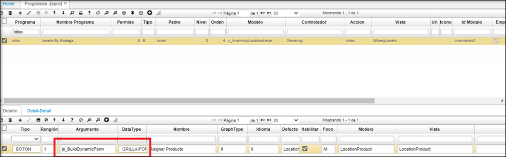
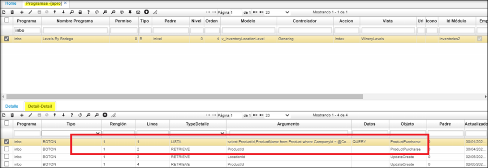
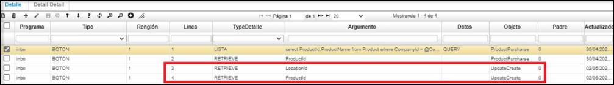
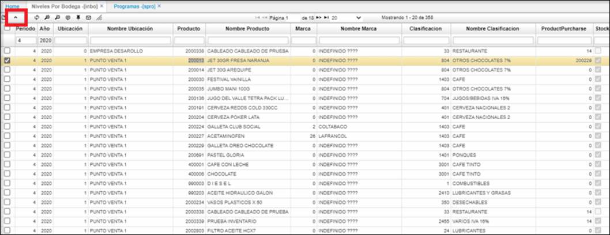
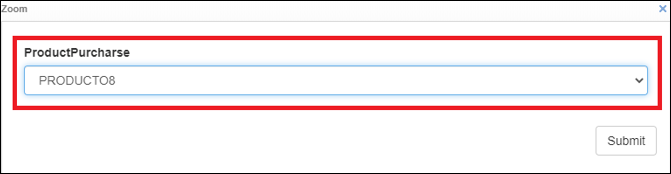

# Niveles por Producto - INPR

Aplicación que permite la consulta de los niveles de stock por producto, en los cuales se ve reflejado los niveles en los saldos por cada producto.  

**Azul - indica que el nivel de la bodega esta arriba del nivel máximo.  
Verde - el nivel esta entre el reorden y el nivel máximo de la bodega.  
Amarillo – su nivel está en el mínimo de reorden.  
Rojo – el nivel de la bodega esta por debajo del nivel mínimo.**  

* ejemplo1
	
* ejemplo2
	

* Para facilitar la consulta de los niveles de stock por producto **INPR**, se han agrego los campos: **marca, nombre marca, clasificación, nombre Clasificación**.  
      
--
# Funcionalidad del zoom en **INBO - INPR**:  
Este zoom  lista los productos asociados según el producto activo; para elegir cual se debe comprar.  
Esta parametrizacion aplica de la misma forma, para las dos opciones, **INBO - INPR**:  

Se realiza la siguiente parametrización del botón **asignar_producto** en **SPRO:**  
**DataType**: Se le indica que es de tipo formulario (Grilla/Form)  
**Defecto**: Nombre de la tabla a actualizar  
** Modelo **: Nombre de la tabla a actualizar  
**Vista**: Nombre del modelo como se encuentra en la aplicación  
  

Al ingresar al**detalle detalle** del botón:  
  
Se puede validar que los 2 primeros registros hacen referencia a un solo campo.  
En el primer renglón se indica el tipo de control y la consulta para cargar la lista, importante dejar el indicador de query sobre el campo de datos.  
Mientras que en el segundo se indica el retrive que debe tomar para la ejecución de la consulta.  
Los dos siguientes campos son para indicarle, sobre cuales campos que son parte de la llave quiero actualizar los datos.  
(tienen que estar en primary key de la tabla estos retrives).  

  
Teniendo clara la configuración del botón:  
Ingresamos al programa **INBO:**  
Seleccionamos el producto 200013 ya que se tiene configurado.  
Le damos clic en el botón configurado.  

  

Podemos validar que se carga de manera correcta la lista.  

  
Realizamos la actualización aplicando el boton submit.  
Este zoom  lista los productos asociados según el producto activo; para elegir cual se debe comprar.  

