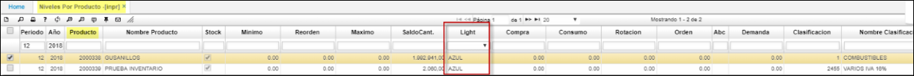
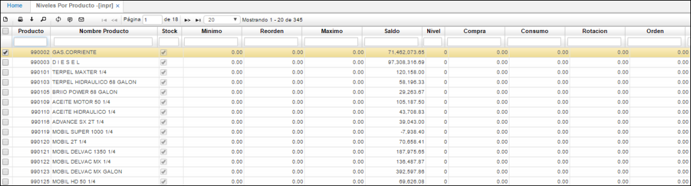
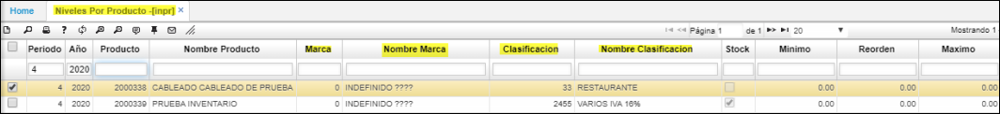

# Niveles por Producto - INPR

Aplicación que permite la consulta de los niveles de stock por producto, en los cuales se ve reflejado los niveles en los saldos por cada producto.  

**Azul - indica que el nivel de la bodega esta arriba del nivel máximo.  
Verde - el nivel esta entre el reorden y el nivel máximo de la bodega.  
Amarillo – su nivel está en el mínimo de reorden.  
Rojo – el nivel de la bodega esta por debajo del nivel mínimo.**  

* ejemplo1
	
* ejemplo2
	

* Para facilitar la consulta de los niveles de stock por producto **INPR**, se han agrego los campos:** marca, nombre marca, 		  
	clasificación, nombre Clasificación**.
    

