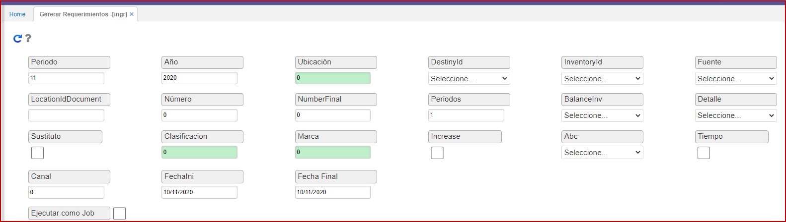
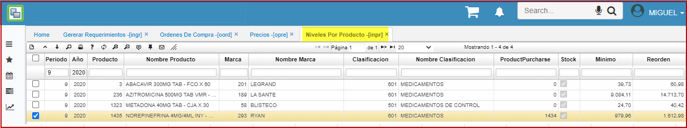

# Generar Requerimientos - INGR  

Generación de órdenes de compra desde el **INGR (Generar Requerimientos)**. Ejecuta procedimiento para que genere las órdenes de compra segun esquema.  
Al generar órdenes de compra se deben tener procesos previos ejecutados como lo son el **INCN** (**calcular niveles de stock**) para que el sistema muestre información en el **INPR** (**niveles por producto**), se recuerda que el **INPR** es para análisis de niveles de stock por producto es decir por compañía.  

  

Los campos resaltado en color, poseen zoom de ayuda: ubicacion, clasificación, marca.  

Procesos previos:

  

