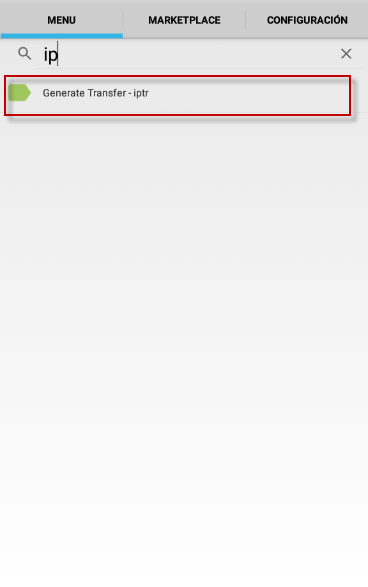
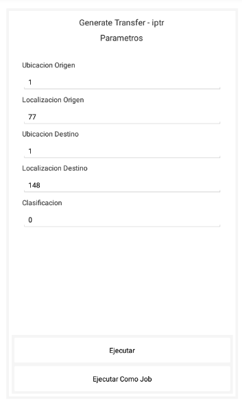
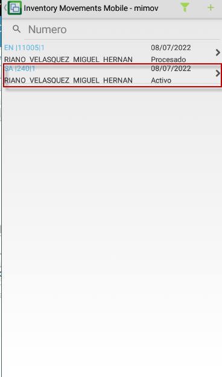

# Genera transferencia - IPTR             

El proceso de generacion de transeferencia permite transferir a diferentes ubicaciones los productos a otras ubicaciones

Para ello ingresamos a la aplicación IPTR 

  

Donde tenemos que tener en cuenta lo siguiente:  

**Ubicación Origen:** Ubicación a la que pertenecen los productos

**Localización Origen:** Localización a la que pertenecen los productos

**Ubicación Destino:** Nueva ubicación a la que se quieren llevar los productos

**Localización Destino:** Nueva localización a la que se quieren llevar los productos

**Clasificación:** En este campo se ingresa la clasificación de los productos en caso de que unicamente se deseen mover prodcutos con determinada clasificación 

  

Luego de Ejecutar el proceso,el sistema crea automáticamente un documento SA * TB (Salida) en la aplicación TMOV

  

Y luego de procesar este documento,el sitema realiza este proceso automáticamente de translado de producto a otra ubicación 

