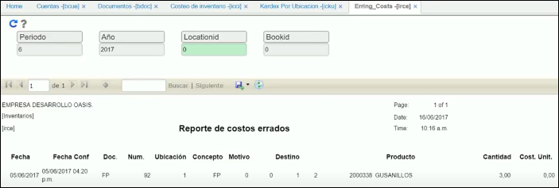

# Costos Errados - IRCE

En esta aplicación encontramos los productos que tienen costo unitario negativo o cero, los cuales se deben validar si son erróneos o es su costo natural, en caso de que sean erróneos se debe realizar el ajuste correspondiente al costo.

