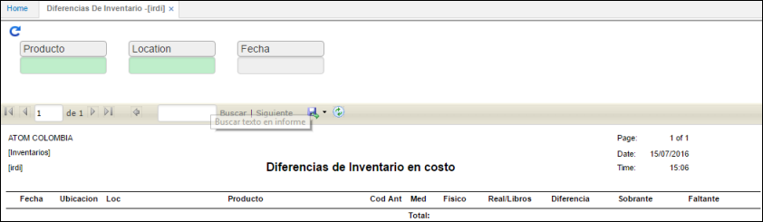

# Diferencias de Inventario - IRDI

Reporte que permite visualizar las diferencias de inventario en costo y a su vez permite se filtre la información por producto, locación y fecha.  

**Producto:** Producto por el cual se desea consultar.  
**Locación:** Locación por la que se desea filtrar.  
**Accountid:** Cuenta por la que se desea filtrar.  

