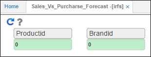

# IRFS - Sales Vs. Purchase Forecast

El reporte de la aplicación **IRFS** muestra las proyecciones de ventas vs. las compras previstas de inventario disponible.  

Se realiza el filtro por Id de Producto y Id de Marca. Si se desean consultar todos los productos y marcas, ingresar el número 0 en cada campo y dar click en el botón _Generar_ 

