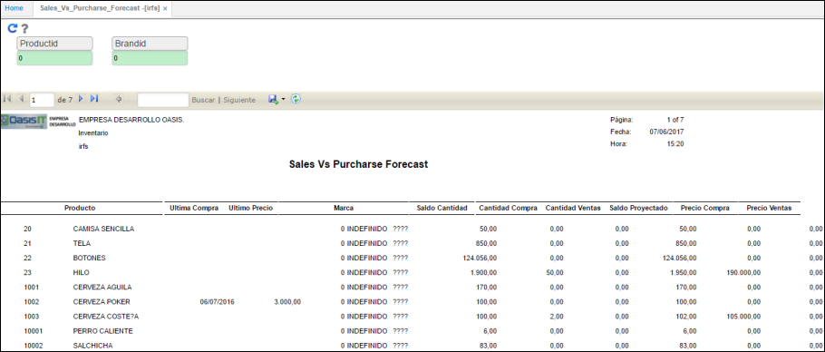

# IRFS - Sales Vs. Purchase Forecast

El reporte de la aplicación **IRFS** muestra las proyecciones de ventas vs. las compras previstas de inventario disponible.  

Se realiza el filtro por Id de Producto y Id de Marca. Si se desean consultar todos los productos y marcas, ingresar el número 0 en cada campo.  

Los campos cuentan con un zoom que facilita la búsqueda, para acceder a ellos basta con dar doble click sobre el campo sobreado de azul.  

Ingresados los datos damod click en el botón _Generar_  y el sistema arrojará el reporte.  

