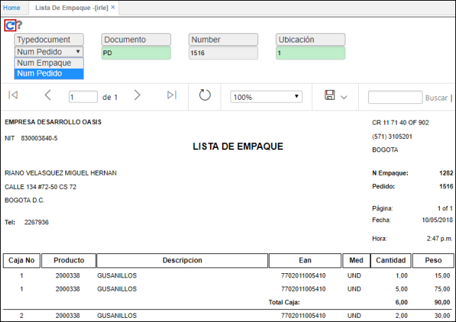
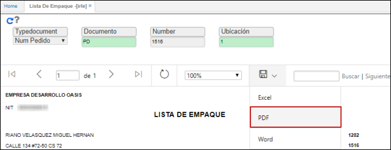
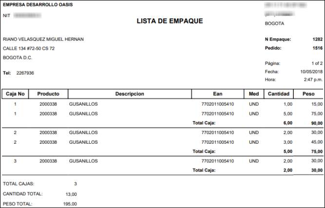

# IRLE - Lista de Empaque

El objetivo del reporte es poder tener listas de empaque de los productos que pasan por el proceso de empaque de WMS.  

El reporte **IRLE** muestra la lista de empaque sin valorizacion. En este reporte se podrá escoger si la busqueda de la información se hace con el documento de empaque o con el documento del pedido.  

El reporte puede ser descargado en formato de Excel, PDF o Word.  

Reporte en formato PDF.  

