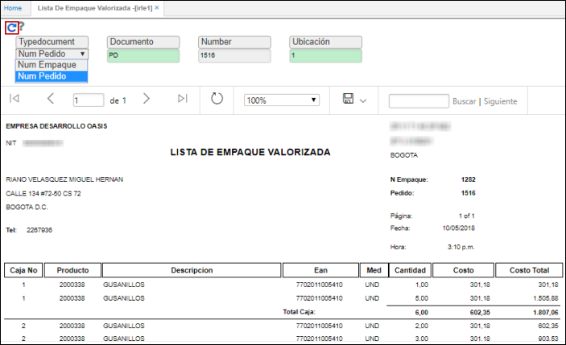
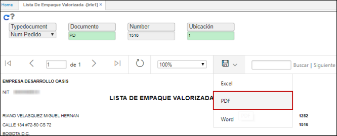
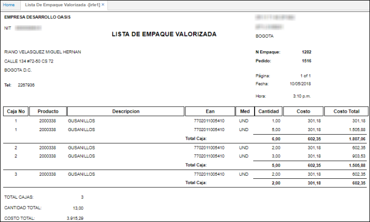

# IRLE1 - Lista de Empaque Valorizada

El objetivo del reporte es poder tener listas de empaque de los productos que pasan por el proceso de empaque de WMS.  

El reporte **IRLE1** muestra la lista de empaque con valorizacion. En este reporte se podrá escoger si la busqueda de la información se hace con el documento de empaque o con el documento del pedido, digitamos documento, número y ubicación de consulta.  

El reporte puede ser descargado en formato de Excel, PDF o Word.  

Formato completo.  

