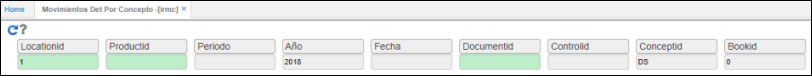
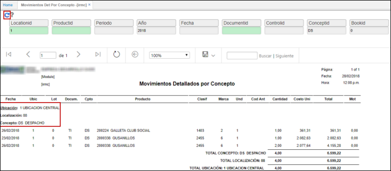

# IRMC - Movimientos Detallados por Concepto

El reporte **IRMC** enseña los movimientos realizados agrupados por concepto y localización.  

Ingresamos al reporte y filtramos por los datos de consulta deseados. En el siguiente ejemplo, consultaremos la información de la ubicación 1, del año 2018, concepto DS - Despachos, libro contable 0.  

Damos click en el botón _Generar_ .  

