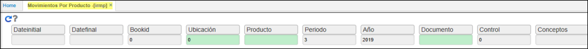
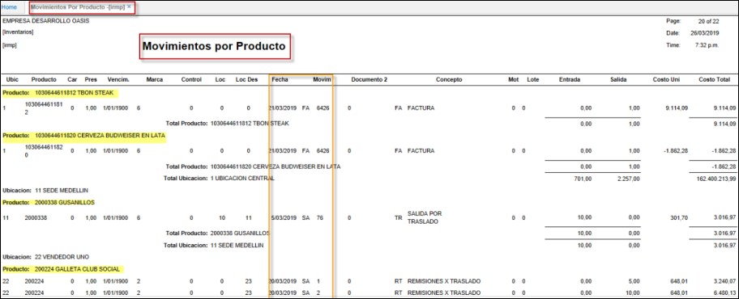

# Movimientos por Producto - IRMP

Aplicación que permite consultar el histórico de las entradas (EN-FP-DE-DV etc.); salidas (SA- FA- DP etc.) por producto, en un determinado rango de fechas.  
Realizar el agrupamiento por producto, ubicación. Discrimina documento, concepto, entrada, salida, costos de la transacción entre otros datos.  

**Fecha inicial:** rango inicial del mes, que desea consultar.  
**Fecha Final:** rango final del mes, que desea consultar.  
**Libro:** parametrización del **KLIB** – libros.  
**Ubicación:** número de ubicación de la empresa en donde se encuentra el producto.  
**Producto:** código asignado en el momento de parametrizar el producto en BPRO.  
**Periodo:** mes en la que se realizó el movimiento.  
**Año:** año en la que se realizó el movimiento.  
**Documento:** Nombre de documento parametrizado con anterioridad en la aplicación **BDOC**.   
**Control:** código interno que se le asigna a cada producto **BCNT**.  
**Conceptos:** se crean en BCON y se asocia documento concepto desde el **BDOC**.  

