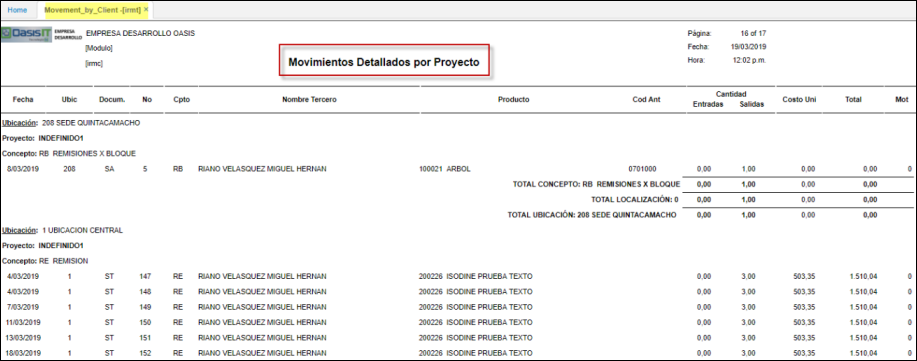

# Movimientos Detallados por Proyecto - IRMT

Reporte que muestra los movimientos de inventario por tercero y por proyecto.
Realiza el agrupamiento por ubicaciones, proyectos, conceptos que se han procesado en el modulo de inventarios.

**Fecha:** Fechador del documento.  
**Ubicacion:** Parametrizacion del **BUBI**.  Locación por la que se desea filtrar.  
**Documento:** Parametrizacion del **BDOC**.  

**Numero Documento:** Parametrizacion del **BCNS**.    
**Concepto:** Parametrizacion del **BDOC**.  
**Tercero:** A quien se realizo la entrada o salida de inventarios.  
**Producto:** Producto por el cual se desea consultar segun **BPRO**.  

**Codigo Antiguo:** Parametrizacion del producto campo OldCode de **BPRO**.  
**Entradas / Salidas:** Valor en unidades de cada producto segun su transaccion.  
**Costo Unitario:** Promedio de la transaccion, en costos.  
**Total:** Valor establecido entre el costo unitario por las cantidades.  

