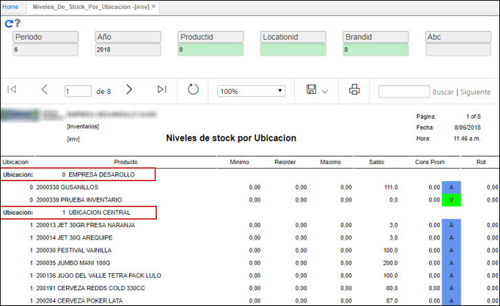

# IRNV - Niveles de Stock por Ubicación

La aplicación IRNV permite la consulta de los niveles de stock por ubicación.  

Es posible realizar un filtro de consulta por producto, ubicación, marca y clasificación ABC, estos dos últimos permiten analizar la rotación de una marca.  

Al consultar el reporte podemos ver los niveles de stock por cada ubicación.  

El reporte puede ser exportado en formato de Excel, PDF o Word.  

En formato de EXCEL.  

